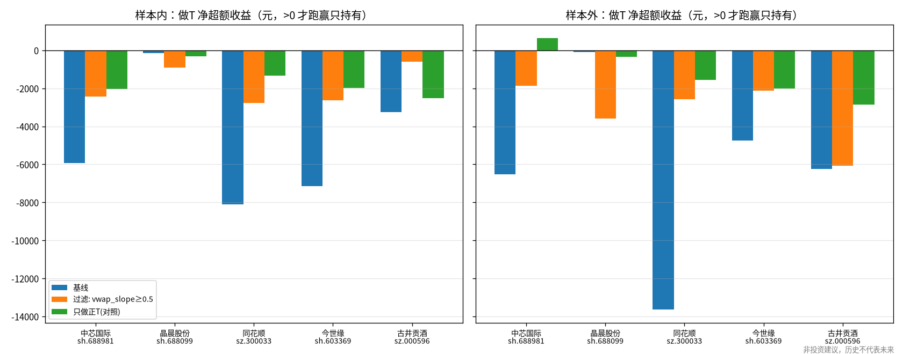
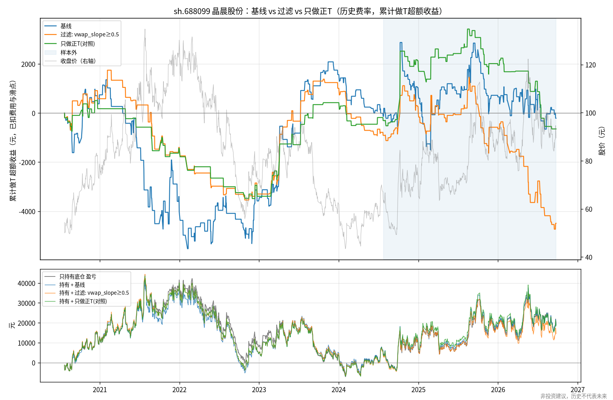

# A 股底仓做T 研究报告 · 第一期

> 第二期（7 个做T 策略族普查）见 [`survey/README.md`](survey/README.md)。

> **非投资建议，历史不代表未来。** 本报告只基于历史数据回测，不构成任何买卖建议，不承诺收益。
> 回测与实盘之间存在成交概率、滑点、延迟、情绪等差异。仓库不含任何个人持仓或账户信息，文中的「底仓 400 股」只是示例规模。

## 0. 结论速览

**基线和按预注册规则选出的过滤方案，在全部 5 只股票、样本内和样本外两个时段里，扣费后都跑输「只持有底仓」。**
唯一的正数是 688981 样本外的「只做正T」对照组（+637 元），它在其余 9 个股票/时段组合里都亏损。
趋势过滤能稳定减少亏损，但不能把亏损变成盈利，也没有打败「永不倒T」这个朴素规则。

做T 净超额收益，单位元，已扣费用和滑点，使用历史真实费率。**正数才表示跑赢只持有**：

| 股票 | 基线 样本内 | 基线 样本外 | 过滤 样本内 | 过滤 样本外 | 只做正T 样本内 | 只做正T 样本外 | 只持有底仓盈亏 样本内 / 样本外 |
|---|---:|---:|---:|---:|---:|---:|---:|
| 中芯国际 688981（参数来源） | -5,926 | -6,527 | -2,422 | -1,871 | -2,026 | **+637** | -12,116 / +28,280 |
| 晶晨股份 688099 | -134 | -78 | -909 | -3,581 | -307 | -341 | +4,687 / +14,320 |
| 同花顺 300033 | -8,104 | -13,627 | -2,756 | -2,562 | -1,327 | -1,543 | -9,618 / +40,590 |
| 今世缘 603369 | -7,153 | -4,750 | -2,627 | -2,128 | -1,978 | -1,998 | +3,624 / -13,784 |
| 古井贡酒 000596 | -3,249 | -6,236 | -583 | -6,062 | -2,515 | -2,866 | +1,058 / -17,386 |
| **4 只新股票合计** | **-18,640** | **-24,690** | -6,875 | **-14,334** | -6,127 | -6,747 | — |

（加粗的合计值，其 95% 自助法区间不含 0，即显著亏损。）

- **原型复现**：与原型逐笔一致（样本内 -5,143.5 元 / 287 笔，样本外 -6,526.5 元 / 182 笔）。
  原型把印花税全期按 0.05% 计算，改用历史真实费率后，688981 基线样本内为 -5,926 元。
- **过滤器**（预注册，只用样本内选择）：入选的是 `vwap_slope ≥ 0.5`，即最近 30 分钟 VWAP 上升至少 0.5×ATR5 时跳过倒T。
  688981 样本外 -1,871 元，比基线好 4,656 元，但 95% 区间 [-1,052, +11,165] 包含 0。按预注册标准判定为**弱成功**。
- **多股票**：过滤器在 4/5 只股票上两个时段都减亏，但晶晨股份两个时段都更差。
  4 只新股票合计，过滤方案相对基线在样本内多赚 1.18 万元、样本外多赚 1.04 万元，两个区间都包含 0。
  **相对「只做正T」，过滤方案在样本外反而少赚 7,586 元**。
- **根本原因**：偏离带信号在 5 只股票上都没有稳定的方向性（§5），毛收益接近 0，费用决定了最终亏损。
  所谓「震荡日赚钱、趋势日亏钱」是事后分类造成的同义反复。
- **建议**：在当前规则下，只持有底仓优于做T。下一步应该先在事件层面找到扣费后仍有正期望的信号，再去搭策略（§8）。


---

## 1. 研究设置

| 项目 | 内容 |
|---|---|
| 数据 | baostock 不复权 5 分钟线 + 日线，688981 为 2020-07-16 ~ 2026-09-24（已与现拉数据逐根核对） |
| 样本切分 | 样本内 2020-07-23 ~ 2024-07-23（971 天），样本外 2024-07-24 ~ 2026-09-24（523 天），与原型一致 |
| 成交 | 5 分钟 K 线收盘确认信号，下一根开盘价成交；滑点 0.02%（至少 1 tick）；整根 K 线封死涨/跌停时拒单 |
| A 股规则 | T+1（当日可卖额度 = 开盘持股）、按板块的涨跌幅与申报数量、14:50 强平回到底仓、封板无法回补则跨夜 |
| 费用 | 佣金 0.025%（最低 5 元）；印花税仅卖出；过户费双向。**研究主口径用历史真实分段费率**（见 §3） |
| 盈亏口径 | 相对「只持有底仓」的**超额收益**（逐日盯市）。**> 0 才算跑赢持有**；「持有+做T」= 底仓盈亏 + 超额收益 |
| 策略 | `vwap_band@v1`（原型移植）：带宽 4×ATR5，止损 1.5×ATR5，止损后当日停做，每日最多 2 个闭环，每次 200 股 |

## 2. 原型复现

`configs/baseline_688981.yaml`（与原型相同的费率口径）在本框架中的结果与原型**逐笔一致**：

| | 原型 | 本框架 |
|---|---:|---:|
| 样本内净收益 / 闭环 | -5,143.5 / 287 | -5,143.5 / 287 |
| 样本外净收益 / 闭环 | -6,526.5 / 182 | -6,526.5 / 182 |
| 全样本逐笔比对（469 笔） | — | 日期、方向、信号时刻、平仓原因完全相同，价格差 < 1e-11 |
| 3×3 参数网格（18 格） | grid.csv | 净收益与闭环次数全部相同 |
| 只持有基准 | -12,116 / +28,280 | -12,116 / +28,280 |

需要说明的实现差异（都不影响原型的数字）：
- 框架对涨跌停封板做了拒单，并把成交价限制在涨跌停价以内。688981 的基线没有触发任何一次（被拒指令 0 次），所以结果不变。
- 框架按逐日盯市计算盈亏，并支持封板时跨夜回补；原型假设总能在尾盘平仓。688981 上没有发生跨夜。
- 盯市和基准使用**官方日收盘价**，而不是最后一根 5 分钟 K 线的收盘价（两者最多相差 0.15%）。第一版曾用后者，
  基准因此差了几十元，已修正。
- 最大回撤从 0 起算（原型从首日的累计值起算），本例数值相同。

回归测试 `tests/test_no_lookahead_and_repro.py::test_baseline_reproduces_prototype` 固定了这些数字。

## 3. 审查意见：原型设计的薄弱点

1. **费用口径偏乐观**。原型全期按印花税 0.05% 计算，但 2023-08-28 之前实际为 0.1%，过户费 2022-04-29 之前为 0.002%。
   按历史费率重算，样本内从 -5,144 元恶化到 **-5,926 元**（门槛过滤掉了 19 个闭环）；样本外不变。后续研究一律使用历史费率。
2. **「震荡日赚钱、趋势日亏钱」是同义反复，不是可利用的规律**。日类型按当日收盘涨跌幅划分，用的是事后信息。
   任何「偏离就反向、回到均值就平仓」的策略，结构上都是做空波动。它在事后被归为震荡的日子里必然赚钱，在趋势日必然亏钱。
   可交易的问题只有一个：**盘中能不能提前识别出趋势日**。§4 专门检验这一点。
3. **毛收益 ≈ 0 与「信号没有方向性」一致**。事件研究（§5）显示，上轨触发后到尾盘的平均顺势收益只有 +6 ~ +9 bp，t 值约 0.3 ~ 0.4。
   在已经分出先后的事件里，先回到 VWAP 的占 35%（样本内）/ 29%（样本外），只比随机游走在「目标 4×ATR、止损 1.5×ATR」下的
   理论值 1.5/5.5 ≈ 27% 略高。换句话说，止盈远、止损近的结构本身就决定了低胜率和接近零的期望，调参数主要改变的是费用多少。
4. **单笔规模太小，最低佣金吃掉大量优势**。200 股 × 45 元 ≈ 9,000 元，按 0.025% 算佣金只有 2.25 元，实际按最低 5 元收取，
   有效费率约 0.056%/边。样本内费用 5,210 元，而毛收益本身是 -716 元。
5. **参数与结论来自同一只股票、同一段行情**。9 个网格全部亏损，没有「调对就赚」的区域。
   样本外（2024-07 以来）以大涨行情为主，对倒T 尤其不利。单一股票的结论需要多股票检验（§6）。
6. **执行假设**。5 分钟 K 线看不到内部路径，止损按收盘判断、下一根开盘成交，跳空时实际亏损会超过 1.5×ATR。
   原型也没有处理封板无法回补的情况（框架已处理）。

## 4. 研究：倒T 趋势/状态过滤（预注册）

规则、参数网格、选择标准和成功标准都在实验运行**之前**写入 [`preregistration.md`](preregistration.md) 并单独提交（commit `99e4fdf`）。
6 类过滤器 × 3 个阈值 × 是否对称 = 36 个候选，全部只使用决策时刻已知的信息（盘中切片或盘前日线），由单元测试检验。
候选须保留至少 50% 的基线闭环数，然后按样本内净收益选择。

**结果（688981，历史费率）**：

| 方案 | 样本内净收益 | 样本内闭环 | 样本外净收益 | 样本外闭环 |
|---|---:|---:|---:|---:|
| 基线（无过滤） | -5,925.9 | 268 | -6,526.5 | 182 |
| **入选：`vwap_slope ≥ 0.5`（30 分钟 VWAP 上升 ≥ 0.5×ATR5 时跳过倒T）** | **-2,422.3** | 155 | **-1,870.8** | 114 |
| 入选规则的翻转版（改做顺势正T） | -3,434.2 | 259 | -842.5 | 181 |
| 对照：只做正T（永不倒T） | -2,025.6 | 111 | +637.4 | 77 |
| 对照：只做倒T | -4,043.3 | 158 | -6,751.6 | 111 |
| 只持有底仓（基准盈亏，非超额） | -12,116 | — | +28,280 | — |

- 翻转版的样本内结果（-3,434）比跳过版差，按预注册规则**不采用**。它的样本外结果较好，但这是事后看到的，不能据此改选。
- **样本外评估（只做一次）**：过滤方案 -1,871 元，比基线好 4,656 元，但配对自助法 95% 区间为 **[-1,052, +11,165]**，包含 0，
  **改善在统计上不显著**。方案仍然**跑输只持有底仓**。
- 与「只做正T」相比：样本外差 -2,508 元（区间 [-6,878, +1,742]）；样本内差 -397 元。
  **过滤器没有打败「完全不做倒T」这个朴素规则**。它的主要作用就是去掉了大部分倒T（样本内倒T 从 157 次降到 44 次）。
- 按原型费率口径：过滤方案样本内 -1,971 元，样本外 -1,871 元（基线为 -5,144 / -6,527）。
- 36 个候选**在样本内全部亏损**。样本内与样本外的相关性主要来自「交易越少、亏得越少」（见散点图）。
- 事后敏感性（未预注册，仅供参考）：把入选过滤器套到 9 组 (k, s) 上，样本内 9/9 减亏、样本外 8/9 减亏，**但没有一组转正**。

**按预注册标准判定：弱成功**。过滤器稳定地减少了亏损，但样本外仍为负，改善也不显著，而且不优于「永不倒T」。


完整候选表、指标和分解见 [`regime/tables.md`](regime/tables.md)，原始数据见 [`regime/candidates.csv`](regime/candidates.csv)，选择过程见 [`regime/selection.json`](regime/selection.json)。

## 5. 信号事件研究：偏离带触发后，价格是回归还是延续？

每天取开仓窗口内第一次触发上轨（收盘 ≥ VWAP + 4×ATR5）和下轨的事件，以下一根开盘价为入场价，不计费用：

| 股票 | 时段 | 事件 | 次数 | 至尾盘顺势收益均值(bp) | t 值 | 先回到VWAP | 先触止损 |
|---|---|---|---:|---:|---:|---:|---:|
| 中芯国际 688981 | 样本内 | 上轨 | 172 | +6.3 | 0.41 | 27% | 51% |
| 中芯国际 688981 | 样本外 | 上轨 | 111 | +8.7 | 0.32 | 23% | 56% |
| 中芯国际 688981 | 样本内 | 下轨 | 122 | +1.1 | 0.07 | 18% | 48% |
| 中芯国际 688981 | 样本外 | 下轨 | 74 | -17.5 | -0.68 | 22% | 39% |
| 晶晨股份 688099 | 样本内 / 样本外 | 上轨 | 135 / 94 | -26.9 / -13.4 | -1.29 / -0.56 | 24% / 22% | 45% / 49% |
| 同花顺 300033 | 样本内 / 样本外 | 上轨 | 198 / 113 | -1.7 / **+62.4** | -0.10 / 1.77 | 26% / 22% | 53% / 58% |
| 今世缘 603369 | 样本内 / 样本外 | 上轨 | 155 / 106 | **-30.9** / -4.6 | **-2.18** / -0.29 | 24% / 21% | 52% / 56% |
| 古井贡酒 000596 | 样本内 / 样本外 | 上轨 | 150 / 123 | -25.2 / -15.2 | -1.66 / -0.91 | 28% / 24% | 45% / 58% |

全部股票、下轨事件的明细见 [`multistock/band_events_summary.csv`](multistock/band_events_summary.csv)。

读法：「至尾盘顺势收益」为正，表示触发后价格继续沿触发方向走（对倒T/正T 不利）。「先回到 VWAP」对应策略的止盈，「先触止损」对应 1.5×ATR 止损。
688981 上两个方向的均值都在 ±20bp 以内，t 值绝对值小于 1，**信号没有可测的方向性**。在已分出先后的上轨事件中，先回到 VWAP 的占 35% / 29%
（样本内 / 样本外），随机游走理论值约 27%，只略高于理论值。一次往返的保本成本约 15 ~ 21bp（含滑点），信号的优势不足以覆盖成本。
其他股票的上轨事件在样本内多呈回归特征（-25 ~ -31bp），但样本外明显减弱，同花顺样本外甚至转为强动量。**方向性因股票和时期而异，不稳定**。

## 6. 多股票检验

**为什么选这几只**：目的是检验结论是不是 688981 独有的。所以要挑做T 最可能奏效的股票：**波动大**（有足够的日内空间覆盖费用），
同时**区间震荡**（没有单边趋势，理论上最适合均值回归）。为了避免「看着结果挑股票」，选股规则写进了预注册文件，
而且只用样本内日线（`scripts/screen_universe.py`）：

- 候选池 415 只：2020-06-29 的沪深300 成分股（用当时的成分，减少幸存者偏差），加上 2020-06-30 前上市的全部科创板股票。
  415 只全部下载成功。
- 条件：可交易天数 ≥ 95%；从未 ST；首日价格 ≥ 10 元；样本内首尾涨跌幅绝对值 ≤ 50%。
  打分 = 日内振幅高 + 日内效率 |收−开|/(高−低) 低（盘中来回震荡）。各板块取第一名：

| 板块 | 股票 | 样本内涨跌 | 日内振幅中位数 | 日内效率中位数 | 每次做T / 底仓 |
|---|---|---:|---:|---:|---|
| 科创板 | 晶晨股份 688099 | +14.7% | 4.36% | 0.41 | 282 / 564 股 |
| 创业板 | 同花顺 300033 | -32.8% | 3.43% | 0.43 | 100 / 200 股 |
| 沪市主板 | 今世缘 603369 | +9.7% | 3.42% | 0.42 | 400 / 800 股 |
| 深市主板 | 古井贡酒 000596 | +1.8% | 3.49% | 0.41 | 100 / 200 股 |

每次做T 的市值按 688981 样本内首日折算（约 1.6 万元），取最近的合规申报数量；策略参数与 688981 **完全相同，没有重新调参**。
完整打分表见 [`universe_screen.csv`](universe_screen.csv)。

**结果**（完整表格见 [`multistock/details.md`](multistock/details.md)）：

| 股票 | 过滤 − 基线 样本内（95% 区间） | 过滤 − 基线 样本外（95% 区间） |
|---|---|---|
| 中芯国际 688981 | +3,504 [442, 6,555] | +4,656 [-1,052, 11,165] |
| 晶晨股份 688099 | -776 [-9,775, 8,359] | -3,503 [-11,662, 4,104] |
| 同花顺 300033 | +5,348 [-458, 11,612] | **+11,064 [1,379, 22,285]** |
| 今世缘 603369 | +4,527 [-1,892, 11,167] | +2,621 [-744, 5,762] |
| 古井贡酒 000596 | +2,666 [-4,821, 9,935] | +174 [-3,367, 3,554] |

- **基线在 5 只股票、两个时段共 10 个组合里全部亏损**。4 只新股票合计样本内 -18,640 元、样本外 -24,690 元，两个区间都不含 0。
  所以这不是 688981 的偶然现象：在这些「看起来最适合做T」的股票上，这套均值回归做T 同样跑输持有。
- **晶晨股份是一个有意义的反例**：基线毛收益为正（样本内 +6,892 元，样本外 +3,570 元），几乎全部被费用吃掉（7,026 / 3,648 元），
  净收益接近 0。它的上轨事件呈回归特征（-27bp），趋势过滤反而去掉了赚钱的倒T。**过滤器的效果取决于股票本身是趋势型还是回归型**。
- 同花顺是唯一在样本外显著受益于过滤的股票。它样本外上涨 +206%（只持有 +40,590 元），上轨事件在样本外转为强动量（+62bp）。
- 引擎的涨跌停处理在真实数据上起了作用：古井贡酒 2021-11-04 尾盘封死涨停（244.81 元），倒T 无法买回，跨夜后次日开盘回补。
  这类情况原型会假设照常成交。



每只股票的净值对比图：
[中芯国际](multistock/equity_sh688981.png) · [晶晨股份](multistock/equity_sh688099.png) · [同花顺](multistock/equity_sz300033.png) ·
[今世缘](multistock/equity_sh603369.png) · [古井贡酒](multistock/equity_sz000596.png)



## 7. 有没有方案跑赢只持有？

**按预先规定的流程，没有。** 本期测试的方案中，扣费后超额收益为正的只有以下几个，而且都不是按规则选出来的：

- 688981 样本外的「只做正T」对照组（+637 元）。它在样本内亏损 2,026 元，其他 4 只股票两个时段也都亏损。
  它在 688981 样本外为正，是因为这段时间股价从约 49 元涨到约 120 元，正T 本质上是在上涨行情里加了日内多头敞口。
- 688981 样本外的少数过滤候选（例如 `day_ret ≥ 3` 为 +1,396 元）。它们在样本内排名靠后（第 6 名），或者不满足闭环数要求，
  事后挑选没有意义。

对长期持有者来说，更直观的是「持有 + 做T」合计：5 只股票里，做T 在两个时段都**降低了**持有的总收益。
例如同花顺样本外，只持有 +40,590 元，持有 + 基线做T 为 +26,963 元。

## 8. 下一步研究方向（按优先级）

1. **先验证信号，再搭策略：出场结构比入场过滤更重要。**
   §5 显示，今世缘、古井贡酒、晶晨的上轨事件在样本内「到尾盘」平均回落 25 ~ 31bp，超过一次往返约 15 ~ 21bp 的成本。
   但策略用 1.5×ATR 的紧止损，45% ~ 52% 的交易先被止损出局，这部分回归收益被截掉了。
   可以预注册一组「卖在上轨、持有到尾盘或只设宽止损（例如 4×ATR）」的出场方案，**只在事件层面先检验**：
   要求扣费后均值 > 0 且 t > 2。然后再到新股票和更新的数据上做样本外验证。风险在于样本外效应明显变弱（-5 ~ -15bp），
   同花顺样本外转为 +62bp 的动量，而且放宽止损会让涨停日的尾部亏损变大。框架里的 `tlab.analysis.band_events` 可以直接复用。
2. **用外生信息识别趋势日，而不是用自身价格。**
   本期 36 个过滤器全部基于个股自身的价格或 VWAP。它们的效果和「少做倒T」难以区分：过滤器不优于「永不倒T」。
   更可能有信息量的是**决策时刻已知的外部状态**，例如大盘或板块指数的日内走势（科创50、半导体指数）、
   个股相对指数的强弱、隔夜外盘（中芯国际可以参考费城半导体指数）。baostock **不提供指数和 ETF 的分钟线**（已实测返回 0 行），
   所以需要先按 `DataSource` 协议接入第二个数据源（例如 akshare/新浪分钟线），并与 baostock 交叉校验。
3. **弄清成本边界，确定哪些股票值得继续研究。**
   晶晨股份的毛收益为正，却被费用抵消。当前规模下（每次约 1.6 万元），最低 5 元佣金和印花税合计约占往返成本的 70% 以上。
   可以做一次费用敏感性网格（佣金 0.01% ~ 0.025%、是否有最低 5 元、每次股数），找出毛收益为正的股票在什么成本下能扣费转正。
   这不是寻找收益，而是在投入更多研究之前，先明确哪些股票、在哪个成本水平下才有继续研究的价值。

**不建议**继续在同一个 VWAP 偏离带策略上加更多过滤条件或细调 k/s。18 个网格格子、36 个过滤候选都在样本内亏损，
继续加参数只会增加过拟合。

## 9. 局限

- 5 分钟 K 线无法反映 K 线内部路径；封板判断只看整根 K 线；假设现金充足、每笔都能按 200 股成交。
- 样本外只有约 2 年，而且以单边大涨为主；多股票检验只有 4 只，统计功效有限。
- 36 个候选的选择存在多重检验偏差，样本内的改善幅度偏乐观。
- 佣金按 0.025%、最低 5 元计算。券商实际费率可能不同，请用 `fees` 配置自行替换。

## 10. 复现与文件清单

```bash
pip install -r requirements.txt && pip install -e . && pytest
tlab run configs/baseline_688981.yaml            # 原型复现 → reports/runs/baseline_688981/
tlab run configs/baseline_688981_histfees.yaml   # 历史费率基线 → reports/runs/baseline_688981_histfees/
python scripts/regime_experiment.py              # → reports/regime/
python scripts/screen_universe.py                # → reports/universe_screen.csv（需联网，约 20 分钟）
python scripts/multistock.py configs/multistock.yaml   # → reports/multistock/
```

| 路径 | 内容 |
|---|---|
| `reports/preregistration.md` | 过滤实验预注册（先于实验提交） |
| `reports/runs/baseline_688981/` | 原型口径复现：指标、分解、逐笔 CSV、逐日 CSV、净值图 |
| `reports/runs/baseline_688981_histfees/` | 历史费率基线 |
| `reports/regime/` | 过滤实验：候选表、选择记录、散点图、净值对比图 |
| `reports/universe_screen.csv` | 多股票筛选的完整打分表 |
| `reports/multistock/` | 多股票检验：汇总、明细、每只股票的净值对比图 |
| `reports/prototype_reference/` | 原型输出的参考结果（grid.csv、tables.md） |

**再次声明：非投资建议，历史不代表未来。**
