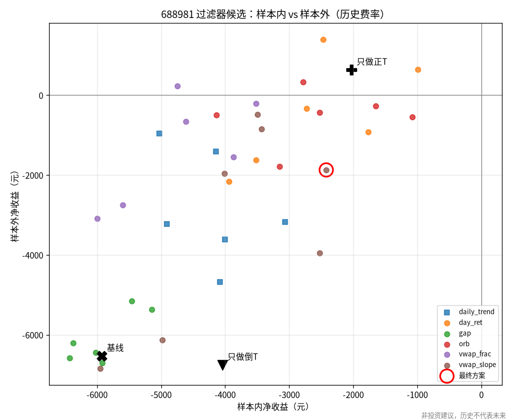
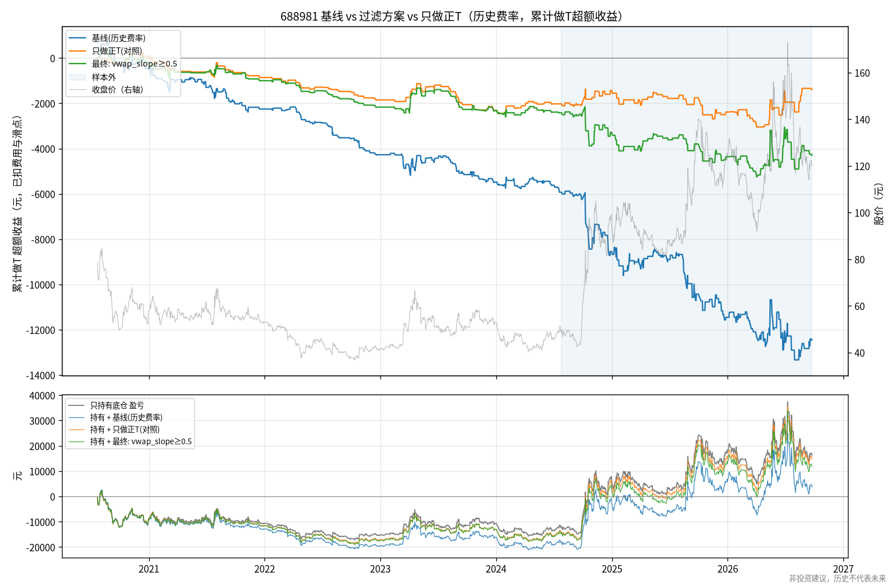

# A 股底仓做T 研究报告 · 第一期

> **非投资建议，历史不代表未来。** 本报告只基于历史数据回测，不构成任何买卖建议，不承诺收益。
> 回测与实盘之间存在成交概率、滑点、延迟、情绪等差异。仓库不含任何个人持仓或账户信息，文中的「底仓 400 股」只是示例规模。

__SUMMARY__

---

## 1. 研究设置

| 项目 | 内容 |
|---|---|
| 数据 | baostock 不复权 5 分钟线 + 日线，688981 为 2020-07-16 ~ 2026-09-24（已与现拉数据逐根核对） |
| 样本切分 | 样本内 2020-07-23 ~ 2024-07-23（971 天），样本外 2024-07-24 ~ 2026-09-24（523 天），与原型一致 |
| 成交 | 5 分钟 K 线收盘确认信号，下一根开盘价成交；滑点 0.02%（至少 1 tick）；整根 K 线封死涨/跌停时拒单 |
| A 股规则 | T+1（当日可卖额度 = 开盘持股）、按板块的涨跌幅与申报数量、14:50 强平回到底仓、封板无法回补则跨夜 |
| 费用 | 佣金 0.025%（最低 5 元）；印花税仅卖出；过户费双向。**研究主口径用历史真实分段费率**（见 §3） |
| 盈亏口径 | 相对「只持有底仓」的**超额收益**（逐日盯市）。**> 0 才算跑赢持有**；「持有+做T」= 底仓盈亏 + 超额收益 |
| 策略 | `vwap_band@v1`（原型移植）：带宽 4×ATR5，止损 1.5×ATR5，止损后当日停做，每日最多 2 个闭环，每次 200 股 |

## 2. 原型复现

`configs/baseline_688981.yaml`（与原型相同的费率口径）在本框架中的结果与原型**逐笔一致**：

| | 原型 | 本框架 |
|---|---:|---:|
| 样本内净收益 / 闭环 | -5,143.5 / 287 | -5,143.5 / 287 |
| 样本外净收益 / 闭环 | -6,526.5 / 182 | -6,526.5 / 182 |
| 全样本逐笔比对（469 笔） | — | 日期、方向、信号时刻、平仓原因完全相同，价格差 < 1e-11 |
| 3×3 参数网格（18 格） | grid.csv | 净收益与闭环次数全部相同 |
| 只持有基准 | -12,116 / +28,280 | -12,116 / +28,280 |

需要说明的实现差异（都不影响原型的数字）：
- 框架对涨跌停封板做了拒单，并把成交价限制在涨跌停价以内。688981 的基线没有触发任何一次（被拒指令 0 次），所以结果不变。
- 框架按逐日盯市计算盈亏，并支持封板时跨夜回补；原型假设总能在尾盘平仓。688981 上没有发生跨夜。
- 盯市和基准使用**官方日收盘价**，而不是最后一根 5 分钟 K 线的收盘价（两者最多相差 0.15%）。第一版曾用后者，
  基准因此差了几十元，已修正。
- 最大回撤从 0 起算（原型从首日的累计值起算），本例数值相同。

回归测试 `tests/test_no_lookahead_and_repro.py::test_baseline_reproduces_prototype` 固定了这些数字。

## 3. 审查意见：原型设计的薄弱点

1. **费用口径偏乐观**。原型全期按印花税 0.05% 计算，但 2023-08-28 之前实际为 0.1%，过户费 2022-04-29 之前为 0.002%。
   按历史费率重算，样本内从 -5,144 元恶化到 **-5,926 元**（门槛过滤掉了 19 个闭环）；样本外不变。后续研究一律使用历史费率。
2. **「震荡日赚钱、趋势日亏钱」是同义反复，不是可利用的规律**。日类型按当日收盘涨跌幅划分，用的是事后信息。
   任何「偏离就反向、回到均值就平仓」的策略，结构上都是做空波动。它在事后被归为震荡的日子里必然赚钱，在趋势日必然亏钱。
   可交易的问题只有一个：**盘中能不能提前识别出趋势日**。§4 专门检验这一点。
3. **毛收益 ≈ 0 与「信号没有方向性」一致**。事件研究（§5）显示，上轨触发后到尾盘的平均顺势收益只有 +6 ~ +9 bp，t 值约 0.3 ~ 0.4。
   先回到 VWAP 的比例（23% ~ 27%）接近随机游走在「目标 4×ATR、止损 1.5×ATR」下的理论值 1.5/5.5 ≈ 27%。
   换句话说，止盈远、止损近的结构本身就决定了低胜率和零期望，调参数只会改变费用的多少。
4. **单笔规模太小，最低佣金吃掉大量优势**。200 股 × 45 元 ≈ 9,000 元，按 0.025% 算佣金只有 2.25 元，实际按最低 5 元收取，
   有效费率约 0.056%/边。样本内费用 5,210 元，而毛收益本身是 -716 元。
5. **参数与结论来自同一只股票、同一段行情**。9 个网格全部亏损，没有「调对就赚」的区域。
   样本外（2024-07 以来）以大涨行情为主，对倒T 尤其不利。单一股票的结论需要多股票检验（§6）。
6. **执行假设**。5 分钟 K 线看不到内部路径，止损按收盘判断、下一根开盘成交，跳空时实际亏损会超过 1.5×ATR。
   原型也没有处理封板无法回补的情况（框架已处理）。

## 4. 研究：倒T 趋势/状态过滤（预注册）

规则、参数网格、选择标准和成功标准都在实验运行**之前**写入 [`preregistration.md`](preregistration.md) 并单独提交（commit `99e4fdf`）。
6 类过滤器 × 3 个阈值 × 是否对称 = 36 个候选，全部只使用决策时刻已知的信息（盘中切片或盘前日线），由单元测试检验。
候选须保留至少 50% 的基线闭环数，然后按样本内净收益选择。

**结果（688981，历史费率）**：

| 方案 | 样本内净收益 | 样本内闭环 | 样本外净收益 | 样本外闭环 |
|---|---:|---:|---:|---:|
| 基线（无过滤） | -5,925.9 | 268 | -6,526.5 | 182 |
| **入选：`vwap_slope ≥ 0.5`（30 分钟 VWAP 上升 ≥ 0.5×ATR5 时跳过倒T）** | **-2,422.3** | 155 | **-1,870.8** | 114 |
| 入选规则的翻转版（改做顺势正T） | -3,434.2 | 259 | -842.5 | 181 |
| 对照：只做正T（永不倒T） | -2,025.6 | 111 | +637.4 | 77 |
| 对照：只做倒T | -4,043.3 | 158 | -6,751.6 | 111 |
| 只持有底仓（基准盈亏，非超额） | -12,116 | — | +28,280 | — |

- 翻转版的样本内结果（-3,434）比跳过版差，按预注册规则**不采用**。它的样本外结果较好，但这是事后看到的，不能据此改选。
- **样本外评估（只做一次）**：过滤方案 -1,871 元，比基线好 4,656 元，但配对自助法 95% 区间为 **[-1,052, +11,165]**，包含 0，
  **改善在统计上不显著**。方案仍然**跑输只持有底仓**。
- 与「只做正T」相比：样本外差 -2,508 元（区间 [-6,878, +1,742]）；样本内差 -397 元。
  **过滤器没有打败「完全不做倒T」这个朴素规则**。它的主要作用就是去掉了大部分倒T（样本内倒T 从 157 次降到 44 次）。
- 按原型费率口径：过滤方案样本内 -1,971 元，样本外 -1,871 元（基线为 -5,144 / -6,527）。
- 36 个候选**在样本内全部亏损**。样本内与样本外的相关性主要来自「交易越少、亏得越少」（见散点图）。
- 事后敏感性（未预注册，仅供参考）：把入选过滤器套到 9 组 (k, s) 上，样本内 9/9 减亏、样本外 8/9 减亏，**但没有一组转正**。

**按预注册标准判定：弱成功**。过滤器稳定地减少了亏损，但样本外仍为负，改善也不显著，而且不优于「永不倒T」。





完整候选表、指标和分解见 [`regime/tables.md`](regime/tables.md)，原始数据见 [`regime/candidates.csv`](regime/candidates.csv)，选择过程见 [`regime/selection.json`](regime/selection.json)。

## 5. 信号事件研究：偏离带触发后，价格是回归还是延续？

每天取开仓窗口内第一次触发上轨（收盘 ≥ VWAP + 4×ATR5）和下轨的事件，以下一根开盘价为入场价，不计费用：

__EVENTS__

读法：「至尾盘顺势收益」为正，表示触发后价格继续沿触发方向走（对倒T/正T 不利）。「先回到 VWAP」对应策略的止盈，「先触止损」对应 1.5×ATR 止损。
688981 上两个方向的均值都在 ±20bp 以内，t 值绝对值小于 1，**信号没有可测的方向性**。随机游走下「先回到 VWAP」的理论比例约为 27%，
实测值与之接近。一次往返的保本成本约 14 ~ 21bp（含滑点），所以没有方向性的信号在扣费后必然亏损。

__MULTI__

__HOLD__

__NEXT__

## 9. 局限

- 5 分钟 K 线无法反映 K 线内部路径；封板判断只看整根 K 线；假设现金充足、每笔都能按 200 股成交。
- 样本外只有约 2 年，而且以单边大涨为主；多股票检验只有 4 只，统计功效有限。
- 36 个候选的选择存在多重检验偏差，样本内的改善幅度偏乐观。
- 佣金按 0.025%、最低 5 元计算。券商实际费率可能不同，请用 `fees` 配置自行替换。

## 10. 复现与文件清单

```bash
pip install -r requirements.txt && pip install -e . && pytest
tlab run configs/baseline_688981.yaml            # 原型复现 → reports/runs/baseline_688981/
tlab run configs/baseline_688981_histfees.yaml   # 历史费率基线 → reports/runs/baseline_688981_histfees/
python scripts/regime_experiment.py              # → reports/regime/
python scripts/screen_universe.py                # → reports/universe_screen.csv（需联网，约 20 分钟）
python scripts/multistock.py configs/multistock.yaml   # → reports/multistock/
```

| 路径 | 内容 |
|---|---|
| `reports/preregistration.md` | 过滤实验预注册（先于实验提交） |
| `reports/runs/baseline_688981/` | 原型口径复现：指标、分解、逐笔 CSV、逐日 CSV、净值图 |
| `reports/runs/baseline_688981_histfees/` | 历史费率基线 |
| `reports/regime/` | 过滤实验：候选表、选择记录、散点图、净值对比图 |
| `reports/universe_screen.csv` | 多股票筛选的完整打分表 |
| `reports/multistock/` | 多股票检验：汇总、明细、每只股票的净值对比图 |
| `reports/prototype_reference/` | 原型输出的参考结果（grid.csv、tables.md） |

**再次声明：非投资建议，历史不代表未来。**
