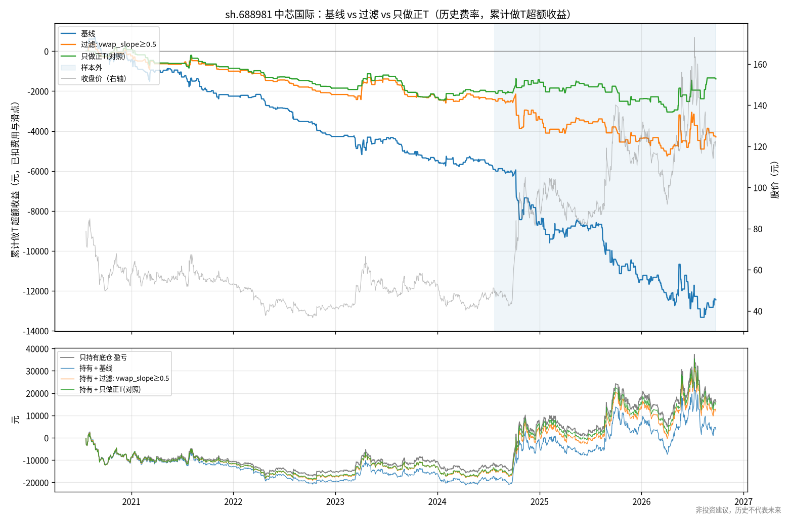
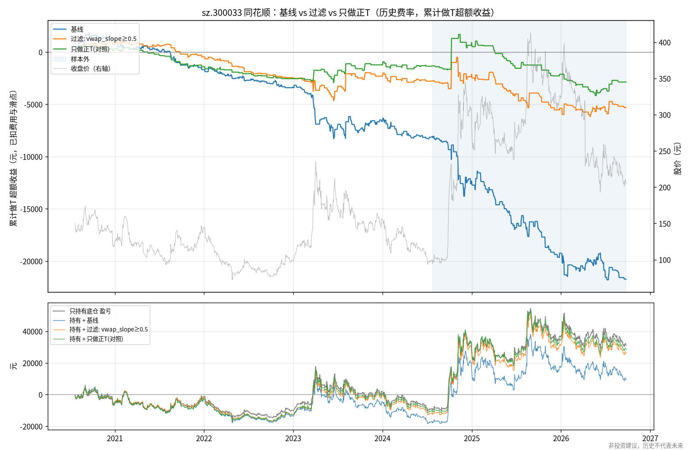
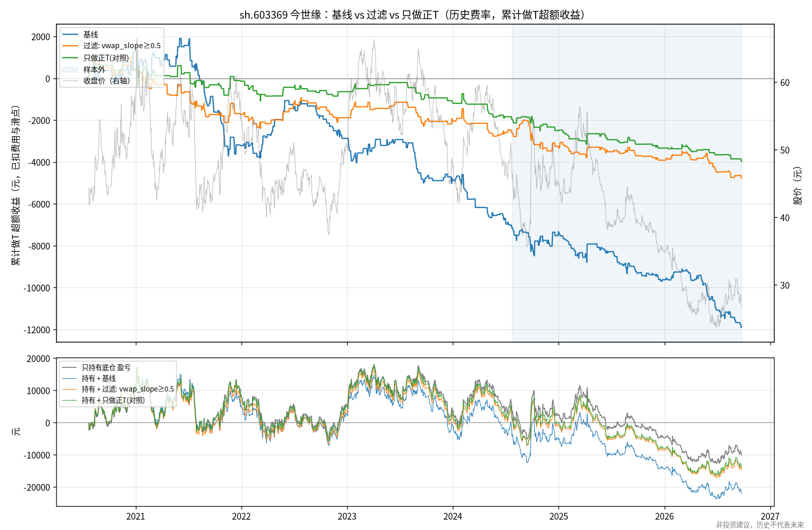
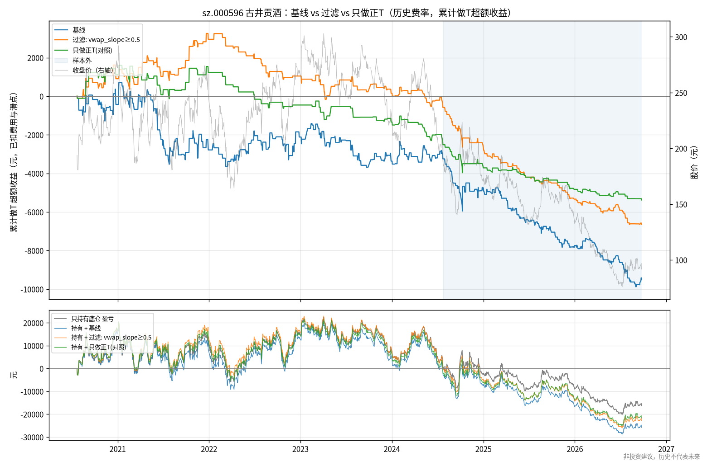

# 多股票检验明细

## 汇总：做T 净超额收益（元，历史费率，已扣费用和滑点）

| code      | name   |   只做正T(对照) / 样本内 |   只做正T(对照) / 样本外 |   基线 / 样本内 |   基线 / 样本外 |   过滤: vwap_slope≥0.5 / 样本内 |   过滤: vwap_slope≥0.5 / 样本外 |   只持有底仓 / 样本内 |   只持有底仓 / 样本外 |
|:----------|:-------|-----------------:|-----------------:|-----------:|-----------:|---------------------------:|---------------------------:|--------------:|--------------:|
| sh.603369 | 今世缘    |          -1977.5 |          -1997.9 |    -7153.2 |    -4749.7 |                    -2626.7 |                    -2128.3 |        3624   |        -13784 |
| sh.688099 | 晶晨股份   |           -307.1 |           -340.8 |     -133.7 |      -78   |                     -909.3 |                    -3581.3 |        4686.8 |         14320 |
| sh.688981 | 中芯国际   |          -2025.6 |            637.4 |    -5925.9 |    -6526.5 |                    -2422.3 |                    -1870.8 |      -12116   |         28280 |
| sz.000596 | 古井贡酒   |          -2515.3 |          -2866.1 |    -3249.2 |    -6235.8 |                     -582.8 |                    -6061.9 |        1058   |        -17386 |
| sz.300033 | 同花顺    |          -1327.4 |          -1542.5 |    -8103.9 |   -13626.7 |                    -2755.8 |                    -2562.2 |       -9618   |         40590 |

## 4 只新股票合并（不含参数来源 sh.688981），逐日加总后自助法

| 时段   | 方案                            |   合计净收益(元) | 95%区间             |
|:-----|:------------------------------|-----------:|:------------------|
| 样本内  | 基线                            |   -18640   | [-37,062, -1,158] |
| 样本内  | 过滤: vwap_slope≥0.5            |    -6874.5 | [-19,024, 5,059]  |
| 样本内  | 只做正T(对照)                      |    -6127.3 | [-16,354, 3,719]  |
| 样本内  | 过滤: vwap_slope≥0.5 − 基线       |    11765.5 | [-3,336, 25,947]  |
| 样本内  | 过滤: vwap_slope≥0.5 − 只做正T(对照) |     -747.2 | [-8,011, 6,519]   |
| 样本外  | 基线                            |   -24690.1 | [-40,465, -8,998] |
| 样本外  | 过滤: vwap_slope≥0.5            |   -14333.7 | [-25,548, -3,130] |
| 样本外  | 只做正T(对照)                      |    -6747.3 | [-15,639, 3,993]  |
| 样本外  | 过滤: vwap_slope≥0.5 − 基线       |    10356.5 | [-2,193, 24,102]  |
| 样本外  | 过滤: vwap_slope≥0.5 − 只做正T(对照) |    -7586.4 | [-16,646, 760]    |

> **非投资建议，历史不代表未来。** 本仓库仅做历史数据研究，不含任何下单或券商接口。

## sh.688981 中芯国际（底仓 400 股，每次 200 股）

| 指标              | 基线 / 样本内         | 基线 / 样本外         | 过滤: vwap_slope≥0.5 / 样本内   | 过滤: vwap_slope≥0.5 / 样本外   | 只做正T(对照) / 样本内   | 只做正T(对照) / 样本外   |
|:----------------|:-----------------|:-----------------|:---------------------------|:---------------------------|:-----------------|:-----------------|
| 交易日数            | 971              | 523              | 971                        | 523                        | 971              | 523              |
| 闭环次数            | 268              | 182              | 155                        | 114                        | 111              | 77               |
| 倒T/正T           | 157/111          | 110/72           | 44/111                     | 38/76                      | 0/111            | 0/77             |
| 做T净收益(元)        | -5925.9          | -6526.5          | -2422.3                    | -1870.8                    | -2025.6          | 637.4            |
| 毛收益(含滑点,未扣费)(元) | -716.0           | -2576.0          | 572.0                      | 614.0                      | 106.0            | 2278.0           |
| 费用合计(元)         | 5209.9           | 3950.5           | 2994.3                     | 2484.8                     | 2131.6           | 1640.6           |
| 胜率(净)           | 36.2%            | 40.7%            | 33.5%                      | 45.6%                      | 32.4%            | 44.2%            |
| 净收益95%自助法区间(元)  | [-9,780, -1,931] | [-14,150, 1,298] | [-5,186, 509]              | [-7,778, 3,868]            | [-4,217, 464]    | [-3,314, 4,418]  |
| 被拒指令数           | 0                | 0                | 0                          | 0                          | 0                | 0                |
| 跨夜未回补次数         | 0                | 0                | 0                          | 0                          | 0                | 0                |
| 基准:只持有底仓盈亏(元)   | -12116.0         | 28280.0          | -12116.0                   | 28280.0                    | -12116.0         | 28280.0          |
| 持有+做T 合计盈亏(元)   | -18041.9         | 21753.5          | -14538.3                   | 26409.2                    | -14141.6         | 28917.4          |

- 样本内：过滤方案 − 基线 = 3,504 元，95% 区间 [442, 6,555]
- 样本外：过滤方案 − 基线 = 4,656 元，95% 区间 [-1,052, 11,165]

### 基线按日类型（事后归因，全样本）

样本内：

| 日类型   |   天数 |   闭环 |   净收益(元) | 胜率   |   倒T净收益 |   正T净收益 |
|:------|-----:|-----:|---------:|:-----|--------:|--------:|
| 上涨趋势日 |  124 |   85 |  -4994.2 | 27%  | -5190.9 |   196.7 |
| 震荡日   |  707 |  119 |    995.5 | 49%  |   784.7 |   210.8 |
| 下跌趋势日 |  140 |   64 |  -1927.2 | 25%  |   505.9 | -2433.1 |

样本外：

| 日类型   |   天数 |   闭环 |   净收益(元) | 胜率   |    倒T净收益 |   正T净收益 |
|:------|-----:|-----:|---------:|:-----|---------:|--------:|
| 上涨趋势日 |  108 |   65 | -11563   | 22%  | -12446.9 |   883.8 |
| 震荡日   |  317 |   84 |   6138.3 | 60%  |   4083.9 |  2054.5 |
| 下跌趋势日 |   98 |   33 |  -1101.8 | 30%  |   1059.7 | -2161.6 |

### 偏离带事件研究（样本内，不含费用）

| 事件   |   次数 |   至尾盘顺势收益均值(bp) |   t值 | 顺势比例   | 先回到VWAP   | 先触止损   | 都未发生   |
|:-----|-----:|----------------:|-----:|:-------|:----------|:-------|:-------|
| 上轨   |  172 |             6.3 | 0.41 | 43%    | 27%       | 51%    | 23%    |
| 下轨   |  122 |             1.1 | 0.07 | 52%    | 18%       | 48%    | 34%    |

### 偏离带事件研究（样本外，不含费用）

| 事件   |   次数 |   至尾盘顺势收益均值(bp) |    t值 | 顺势比例   | 先回到VWAP   | 先触止损   | 都未发生   |
|:-----|-----:|----------------:|------:|:-------|:----------|:-------|:-------|
| 上轨   |  111 |             8.7 |  0.32 | 45%    | 23%       | 56%    | 21%    |
| 下轨   |   74 |           -17.5 | -0.68 | 51%    | 22%       | 39%    | 39%    |

## sh.688099 晶晨股份（底仓 564 股，每次 282 股）

| 指标              | 基线 / 样本内          | 基线 / 样本外         | 过滤: vwap_slope≥0.5 / 样本内   | 过滤: vwap_slope≥0.5 / 样本外   | 只做正T(对照) / 样本内   | 只做正T(对照) / 样本外   |
|:----------------|:------------------|:-----------------|:---------------------------|:---------------------------|:-----------------|:-----------------|
| 交易日数            | 971               | 529              | 971                        | 529                        | 971              | 529              |
| 闭环次数            | 204               | 152              | 110                        | 88                         | 71               | 58               |
| 倒T/正T           | 134/70            | 95/57            | 39/71                      | 30/58                      | 0/71             | 0/58             |
| 做T净收益(元)        | -133.7            | -78.0            | -909.3                     | -3581.3                    | -307.1           | -340.8           |
| 毛收益(含滑点,未扣费)(元) | 6892.1            | 3570.1           | 2679.0                     | -1472.0                    | 1990.9           | 1018.0           |
| 费用合计(元)         | 7025.8            | 3648.1           | 3588.3                     | 2109.3                     | 2298.0           | 1358.8           |
| 胜率(净)           | 46.6%             | 44.1%            | 45.5%                      | 42.0%                      | 46.5%            | 44.8%            |
| 净收益95%自助法区间(元)  | [-10,819, 10,742] | [-9,476, 10,144] | [-7,600, 5,769]            | [-9,839, 2,942]            | [-5,579, 5,121]  | [-5,627, 5,791]  |
| 被拒指令数           | 0                 | 0                | 0                          | 0                          | 0                | 0                |
| 跨夜未回补次数         | 0                 | 0                | 0                          | 0                          | 0                | 0                |
| 基准:只持有底仓盈亏(元)   | 4686.8            | 14320.0          | 4686.8                     | 14320.0                    | 4686.8           | 14320.0          |
| 持有+做T 合计盈亏(元)   | 4553.1            | 14242.0          | 3777.6                     | 10738.6                    | 4379.7           | 13979.1          |

- 样本内：过滤方案 − 基线 = -776 元，95% 区间 [-9,775, 8,359]
- 样本外：过滤方案 − 基线 = -3,503 元，95% 区间 [-11,662, 4,104]

### 基线按日类型（事后归因，全样本）

样本内：

| 日类型   |   天数 |   闭环 |   净收益(元) | 胜率   |   倒T净收益 |   正T净收益 |
|:------|-----:|-----:|---------:|:-----|--------:|--------:|
| 上涨趋势日 |  218 |  111 |  -3216.2 | 42%  | -5171.3 |  1955.1 |
| 震荡日   |  528 |   50 |   4978.8 | 66%  |  4630.6 |   348.2 |
| 下跌趋势日 |  225 |   43 |  -1896.3 | 35%  |  1359.6 | -3256   |

样本外：

| 日类型   |   天数 |   闭环 |   净收益(元) | 胜率   |   倒T净收益 |   正T净收益 |
|:------|-----:|-----:|---------:|:-----|--------:|--------:|
| 上涨趋势日 |  111 |   66 |  -4926.1 | 35%  | -6188.9 |  1262.9 |
| 震荡日   |  306 |   54 |  10250.7 | 67%  |  6053.7 |  4197   |
| 下跌趋势日 |  112 |   32 |  -5402.6 | 25%  |   605.4 | -6008   |

### 偏离带事件研究（样本内，不含费用）

| 事件   |   次数 |   至尾盘顺势收益均值(bp) |    t值 | 顺势比例   | 先回到VWAP   | 先触止损   | 都未发生   |
|:-----|-----:|----------------:|------:|:-------|:----------|:-------|:-------|
| 上轨   |  135 |           -26.9 | -1.29 | 40%    | 24%       | 45%    | 30%    |
| 下轨   |   69 |           -13.9 | -0.44 | 43%    | 20%       | 43%    | 36%    |

### 偏离带事件研究（样本外，不含费用）

| 事件   |   次数 |   至尾盘顺势收益均值(bp) |    t值 | 顺势比例   | 先回到VWAP   | 先触止损   | 都未发生   |
|:-----|-----:|----------------:|------:|:-------|:----------|:-------|:-------|
| 上轨   |   94 |           -13.4 | -0.56 | 44%    | 22%       | 49%    | 29%    |
| 下轨   |   55 |           -24   | -0.75 | 53%    | 25%       | 36%    | 38%    |

## sz.300033 同花顺（底仓 200 股，每次 100 股）

| 指标              | 基线 / 样本内        | 基线 / 样本外          | 过滤: vwap_slope≥0.5 / 样本内   | 过滤: vwap_slope≥0.5 / 样本外   | 只做正T(对照) / 样本内   | 只做正T(对照) / 样本外   |
|:----------------|:----------------|:------------------|:---------------------------|:---------------------------|:-----------------|:-----------------|
| 交易日数            | 971             | 529               | 971                        | 529                        | 971              | 529              |
| 闭环次数            | 311             | 167               | 168                        | 100                        | 115              | 59               |
| 倒T/正T           | 201/110         | 114/53            | 54/114                     | 41/59                      | 0/115            | 0/59             |
| 做T净收益(元)        | -8103.9         | -13626.7          | -2755.8                    | -2562.2                    | -1327.4          | -1542.5          |
| 毛收益(含滑点,未扣费)(元) | -1470.0         | -9038.0           | 868.0                      | 133.0                      | 1096.0           | 26.0             |
| 费用合计(元)         | 6633.9          | 4588.7            | 3623.8                     | 2695.2                     | 2423.4           | 1568.5           |
| 胜率(净)           | 40.8%           | 32.9%             | 39.3%                      | 34.0%                      | 37.4%            | 32.2%            |
| 净收益95%自助法区间(元)  | [-15,418, -417] | [-24,385, -3,530] | [-8,988, 3,761]            | [-10,064, 5,372]           | [-5,725, 3,438]  | [-6,961, 4,658]  |
| 被拒指令数           | 0               | 0                 | 0                          | 0                          | 0                | 0                |
| 跨夜未回补次数         | 0               | 0                 | 0                          | 0                          | 0                | 0                |
| 基准:只持有底仓盈亏(元)   | -9618.0         | 40590.0           | -9618.0                    | 40590.0                    | -9618.0          | 40590.0          |
| 持有+做T 合计盈亏(元)   | -17721.9        | 26963.3           | -12373.8                   | 38027.8                    | -10945.4         | 39047.5          |

- 样本内：过滤方案 − 基线 = 5,348 元，95% 区间 [-458, 11,612]
- 样本外：过滤方案 − 基线 = 11,064 元，95% 区间 [1,379, 22,285]

### 基线按日类型（事后归因，全样本）

样本内：

| 日类型   |   天数 |   闭环 |   净收益(元) | 胜率   |    倒T净收益 |   正T净收益 |
|:------|-----:|-----:|---------:|:-----|---------:|--------:|
| 上涨趋势日 |  176 |  125 | -10599   | 30%  | -11604.8 |  1005.8 |
| 震荡日   |  596 |  118 |   6447.3 | 60%  |   5591.3 |   856.1 |
| 下跌趋势日 |  199 |   68 |  -3952.3 | 28%  |    318.4 | -4270.6 |

样本外：

| 日类型   |   天数 |   闭环 |   净收益(元) | 胜率   |    倒T净收益 |   正T净收益 |
|:------|-----:|-----:|---------:|:-----|---------:|--------:|
| 上涨趋势日 |  107 |   79 | -13628.6 | 24%  | -14701.8 |  1073.2 |
| 震荡日   |  311 |   53 |   1698.4 | 51%  |   2649.7 |  -951.2 |
| 下跌趋势日 |  111 |   35 |  -1696.5 | 26%  |   1085.4 | -2781.9 |

### 偏离带事件研究（样本内，不含费用）

| 事件   |   次数 |   至尾盘顺势收益均值(bp) |    t值 | 顺势比例   | 先回到VWAP   | 先触止损   | 都未发生   |
|:-----|-----:|----------------:|------:|:-------|:----------|:-------|:-------|
| 上轨   |  198 |            -1.7 | -0.1  | 42%    | 26%       | 53%    | 22%    |
| 下轨   |  112 |             5.7 |  0.33 | 50%    | 18%       | 48%    | 34%    |

### 偏离带事件研究（样本外，不含费用）

| 事件   |   次数 |   至尾盘顺势收益均值(bp) |   t值 | 顺势比例   | 先回到VWAP   | 先触止损   | 都未发生   |
|:-----|-----:|----------------:|-----:|:-------|:----------|:-------|:-------|
| 上轨   |  113 |            62.4 | 1.77 | 48%    | 22%       | 58%    | 19%    |
| 下轨   |   58 |             1.5 | 0.05 | 62%    | 16%       | 48%    | 36%    |

## sh.603369 今世缘（底仓 800 股，每次 400 股）

| 指标              | 基线 / 样本内       | 基线 / 样本外       | 过滤: vwap_slope≥0.5 / 样本内   | 过滤: vwap_slope≥0.5 / 样本外   | 只做正T(对照) / 样本内   | 只做正T(对照) / 样本外   |
|:----------------|:---------------|:---------------|:---------------------------|:---------------------------|:-----------------|:-----------------|
| 交易日数            | 971            | 529            | 971                        | 529                        | 971              | 529              |
| 闭环次数            | 250            | 168            | 145                        | 102                        | 94               | 63               |
| 倒T/正T           | 157/93         | 106/62         | 51/94                      | 40/62                      | 0/94             | 0/63             |
| 做T净收益(元)        | -7153.2        | -4749.7        | -2626.7                    | -2128.3                    | -1977.5          | -1997.9          |
| 毛收益(含滑点,未扣费)(元) | 332.0          | -1740.0        | 1624.0                     | -312.0                     | 784.0            | -868.0           |
| 费用合计(元)         | 7485.2         | 3009.7         | 4250.7                     | 1816.3                     | 2761.5           | 1129.9           |
| 胜率(净)           | 42.8%          | 35.1%          | 44.1%                      | 40.2%                      | 42.6%            | 31.7%            |
| 净收益95%自助法区间(元)  | [-14,881, 654] | [-8,970, -380] | [-7,848, 2,368]            | [-5,087, 756]              | [-6,332, 2,264]  | [-4,195, 271]    |
| 被拒指令数           | 0              | 0              | 0                          | 0                          | 0                | 0                |
| 跨夜未回补次数         | 0              | 0              | 0                          | 0                          | 0                | 0                |
| 基准:只持有底仓盈亏(元)   | 3624.0         | -13784.0       | 3624.0                     | -13784.0                   | 3624.0           | -13784.0         |
| 持有+做T 合计盈亏(元)   | -3529.2        | -18533.7       | 997.3                      | -15912.3                   | 1646.5           | -15781.9         |

- 样本内：过滤方案 − 基线 = 4,527 元，95% 区间 [-1,892, 11,167]
- 样本外：过滤方案 − 基线 = 2,621 元，95% 区间 [-744, 5,762]

### 基线按日类型（事后归因，全样本）

样本内：

| 日类型   |   天数 |   闭环 |   净收益(元) | 胜率   |    倒T净收益 |   正T净收益 |
|:------|-----:|-----:|---------:|:-----|---------:|--------:|
| 上涨趋势日 |  179 |   96 | -11093.5 | 28%  | -12462.2 |  1368.7 |
| 震荡日   |  638 |  110 |   5664.2 | 59%  |   5273.7 |   390.4 |
| 下跌趋势日 |  154 |   44 |  -1723.9 | 34%  |   1740   | -3463.9 |

样本外：

| 日类型   |   天数 |   闭环 |   净收益(元) | 胜率   |   倒T净收益 |   正T净收益 |
|:------|-----:|-----:|---------:|:-----|--------:|--------:|
| 上涨趋势日 |   66 |   55 |  -3864.4 | 27%  | -4111.1 |   246.7 |
| 震荡日   |  385 |   84 |    709   | 44%  |  1278   |  -568.9 |
| 下跌趋势日 |   78 |   29 |  -1594.4 | 24%  |   -95.2 | -1499.2 |

### 偏离带事件研究（样本内，不含费用）

| 事件   |   次数 |   至尾盘顺势收益均值(bp) |    t值 | 顺势比例   | 先回到VWAP   | 先触止损   | 都未发生   |
|:-----|-----:|----------------:|------:|:-------|:----------|:-------|:-------|
| 上轨   |  155 |           -30.9 | -2.18 | 34%    | 24%       | 52%    | 25%    |
| 下轨   |   94 |           -19.4 | -1.33 | 41%    | 15%       | 43%    | 43%    |

### 偏离带事件研究（样本外，不含费用）

| 事件   |   次数 |   至尾盘顺势收益均值(bp) |    t值 | 顺势比例   | 先回到VWAP   | 先触止损   | 都未发生   |
|:-----|-----:|----------------:|------:|:-------|:----------|:-------|:-------|
| 上轨   |  106 |            -4.6 | -0.29 | 38%    | 21%       | 56%    | 24%    |
| 下轨   |   65 |             8.9 |  0.56 | 52%    | 17%       | 51%    | 32%    |

## sz.000596 古井贡酒（底仓 200 股，每次 100 股）

| 指标              | 基线 / 样本内         | 基线 / 样本外          | 过滤: vwap_slope≥0.5 / 样本内   | 过滤: vwap_slope≥0.5 / 样本外   | 只做正T(对照) / 样本内   | 只做正T(对照) / 样本外   |
|:----------------|:-----------------|:------------------|:---------------------------|:---------------------------|:-----------------|:-----------------|
| 交易日数            | 971              | 529               | 971                        | 529                        | 971              | 529              |
| 闭环次数            | 238              | 191               | 136                        | 114                        | 90               | 74               |
| 倒T/正T           | 150/88           | 122/69            | 46/90                      | 41/73                      | 0/90             | 0/74             |
| 做T净收益(元)        | -3249.2          | -6235.8           | -582.8                     | -6061.9                    | -2515.3          | -2866.1          |
| 毛收益(含滑点,未扣费)(元) | 4796.0           | -2923.0           | 3953.0                     | -4090.0                    | 406.0            | -1580.0          |
| 费用合计(元)         | 8045.2           | 3312.8            | 4535.8                     | 1971.9                     | 2921.3           | 1286.1           |
| 胜率(净)           | 43.7%            | 36.6%             | 46.3%                      | 28.9%                      | 38.9%            | 31.1%            |
| 净收益95%自助法区间(元)  | [-12,437, 5,977] | [-10,890, -1,561] | [-7,414, 5,929]            | [-8,954, -3,507]           | [-8,004, 3,000]  | [-5,261, -608]   |
| 被拒指令数           | 0                | 0                 | 2                          | 0                          | 0                | 0                |
| 跨夜未回补次数         | 0                | 0                 | 1                          | 0                          | 0                | 0                |
| 基准:只持有底仓盈亏(元)   | 1058.0           | -17386.0          | 1058.0                     | -17386.0                   | 1058.0           | -17386.0         |
| 持有+做T 合计盈亏(元)   | -2191.2          | -23621.8          | 475.2                      | -23447.9                   | -1457.3          | -20252.1         |

- 样本内：过滤方案 − 基线 = 2,666 元，95% 区间 [-4,821, 9,935]
- 样本外：过滤方案 − 基线 = 174 元，95% 区间 [-3,367, 3,554]

### 基线按日类型（事后归因，全样本）

样本内：

| 日类型   |   天数 |   闭环 |   净收益(元) | 胜率   |   倒T净收益 |   正T净收益 |
|:------|-----:|-----:|---------:|:-----|--------:|--------:|
| 上涨趋势日 |  171 |  104 |  -4955.6 | 41%  | -7220   |  2264.3 |
| 震荡日   |  636 |   88 |   5514.6 | 56%  |  6148.1 |  -633.5 |
| 下跌趋势日 |  164 |   46 |  -3808.2 | 26%  |     0   | -3808.2 |

样本外：

| 日类型   |   天数 |   闭环 |   净收益(元) | 胜率   |   倒T净收益 |   正T净收益 |
|:------|-----:|-----:|---------:|:-----|--------:|--------:|
| 上涨趋势日 |   70 |   60 |  -5119   | 22%  | -4781.1 |  -337.9 |
| 震荡日   |  365 |   98 |   1258.6 | 51%  |  1463.7 |  -205.1 |
| 下跌趋势日 |   94 |   33 |  -2375.3 | 21%  |  -171.9 | -2203.4 |

### 偏离带事件研究（样本内，不含费用）

| 事件   |   次数 |   至尾盘顺势收益均值(bp) |    t值 | 顺势比例   | 先回到VWAP   | 先触止损   | 都未发生   |
|:-----|-----:|----------------:|------:|:-------|:----------|:-------|:-------|
| 上轨   |  150 |           -25.2 | -1.66 | 45%    | 28%       | 45%    | 27%    |
| 下轨   |   90 |           -24   | -1.54 | 47%    | 19%       | 42%    | 39%    |

### 偏离带事件研究（样本外，不含费用）

| 事件   |   次数 |   至尾盘顺势收益均值(bp) |    t值 | 顺势比例   | 先回到VWAP   | 先触止损   | 都未发生   |
|:-----|-----:|----------------:|------:|:-------|:----------|:-------|:-------|
| 上轨   |  123 |           -15.2 | -0.91 | 37%    | 24%       | 58%    | 18%    |
| 下轨   |   72 |            11.1 |  0.82 | 54%    | 17%       | 53%    | 31%    |

