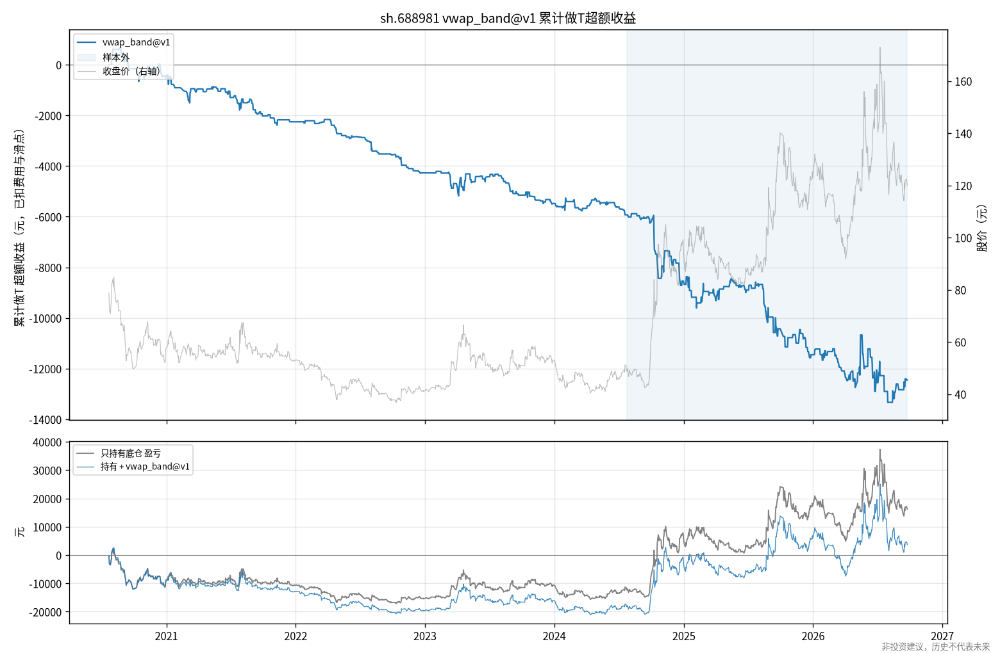

# 回测报告：baseline_688981_histfees

> **非投资建议，历史不代表未来。** 本仓库仅做历史数据研究，不含任何下单或券商接口。

修正费用口径后的基线：印花税 2023-08-28 前 0.1%、之后 0.05%；过户费 2022-04-29 前 0.002%、之后 0.001%。 其余与原型相同。这是后续所有研究的主口径。

- 代码版本：`ae5b36f`
- 配置：`{"config": "configs/baseline_688981_histfees.yaml"}`

## sh.688981  （策略 `vwap_band@v1`）

参数：`{"k": 4.0, "s": 1.5, "lot": 200, "max_trips": 2, "gate": 3.0, "atr_days": 5, "entry_start": 945, "entry_end": 1430, "near_limit": 0.005, "sides": "both", "halt_on_stop": true}`

| 指标                | 样本内                   | 样本外                   |
|:------------------|:----------------------|:----------------------|
| 区间                | 2020-07-23~2024-07-23 | 2024-07-24~2026-09-24 |
| 交易日数              | 971                   | 523                   |
| 有做T的天数            | 255                   | 175                   |
| 闭环次数              | 268                   | 182                   |
| 倒T/正T             | 157/111               | 110/72                |
| 做T净收益(元)          | -5925.9               | -6526.5               |
| 毛收益(含滑点,未扣费)(元)   | -716.0                | -2576.0               |
| 费用合计(元)           | 5209.9                | 3950.5                |
| 胜率(净)             | 36.2%                 | 40.7%                 |
| 平均盈利(元)           | 108.4                 | 246.7                 |
| 平均亏损(元)           | -96.1                 | -229.5                |
| 单笔平均净收益(元)        | -22.11                | -35.86                |
| 日均净收益t值           | -2.95                 | -1.64                 |
| 净收益95%自助法区间(元)    | [-9,780, -1,931]      | [-14,150, 1,298]      |
| 最差单日(元)           | -366.4                | -930.3                |
| 累计净收益最大回撤(元)      | -6622.9               | -7447.4               |
| 止盈TP/止损STOP/尾盘EOD | 58/131/79             | 39/91/52              |
| 跨夜未回补次数           | 0                     | 0                     |
| 被拒指令数             | 0                     | 0                     |
| 基准:只持有底仓盈亏(元)     | -12116.0              | 28280.0               |
| 持有+做T 合计盈亏(元)     | -18041.9              | 21753.5               |

### 按日类型（事后归因，样本内）

| 日类型   |   天数 |   闭环 |   净收益(元) | 胜率   |   倒T净收益 |   正T净收益 |
|:------|-----:|-----:|---------:|:-----|--------:|--------:|
| 上涨趋势日 |  124 |   85 |  -4994.2 | 27%  | -5190.9 |   196.7 |
| 震荡日   |  707 |  119 |    995.5 | 49%  |   784.7 |   210.8 |
| 下跌趋势日 |  140 |   64 |  -1927.2 | 25%  |   505.9 | -2433.1 |

### 按方向与平仓原因（样本内）

| dir   | entry_tag   | reason   |   次数 |     净收益 |     平均 |
|:------|:------------|:---------|-----:|--------:|-------:|
| 倒T    | open_dao    | EOD      |   37 |   515.2 |   13.9 |
| 倒T    | open_dao    | STOP     |   79 | -9863.8 | -124.9 |
| 倒T    | open_dao    | TP       |   41 |  5448.2 |  132.9 |
| 正T    | open_zheng  | EOD      |   42 |   143.4 |    3.4 |
| 正T    | open_zheng  | STOP     |   52 | -5168.7 |  -99.4 |
| 正T    | open_zheng  | TP       |   17 |  2999.6 |  176.4 |

### 按日类型（事后归因，样本外）

| 日类型   |   天数 |   闭环 |   净收益(元) | 胜率   |    倒T净收益 |   正T净收益 |
|:------|-----:|-----:|---------:|:-----|---------:|--------:|
| 上涨趋势日 |  108 |   65 | -11563   | 22%  | -12446.9 |   883.8 |
| 震荡日   |  317 |   84 |   6138.3 | 60%  |   4083.9 |  2054.5 |
| 下跌趋势日 |   98 |   33 |  -1101.8 | 30%  |   1059.7 | -2161.6 |

### 按方向与平仓原因（样本外）

| dir   | entry_tag   | reason   |   次数 |      净收益 |     平均 |
|:------|:------------|:---------|-----:|---------:|-------:|
| 倒T    | open_dao    | EOD      |   22 |   2871.3 |  130.5 |
| 倒T    | open_dao    | STOP     |   64 | -17794.5 | -278   |
| 倒T    | open_dao    | TP       |   24 |   7620   |  317.5 |
| 正T    | open_zheng  | EOD      |   30 |    736.9 |   24.6 |
| 正T    | open_zheng  | STOP     |   27 |  -5199.8 | -192.6 |
| 正T    | open_zheng  | TP       |   15 |   5239.6 |  349.3 |

### 分年度

|   年份 |   交易日 |   闭环 |   做T净收益(元) |   费用(元) |   只持有底仓盈亏(元) | 年内涨跌幅   |
|-----:|------:|-----:|-----------:|--------:|-------------:|:--------|
| 2020 |   110 |   37 |     -465.8 |   847.8 |        -8728 | -27.4%  |
| 2021 |   243 |   69 |    -1787   |  1515   |        -1904 | -8.2%   |
| 2022 |   242 |   55 |    -2019.2 |  1031.2 |        -4740 | -22.4%  |
| 2023 |   242 |   62 |    -1206.9 |  1152.9 |         4752 | 28.9%   |
| 2024 |   242 |   82 |    -3065.4 |  1311.4 |        16640 | 78.5%   |
| 2025 |   237 |   82 |    -2906.9 |  1720.9 |        11284 | 29.8%   |
| 2026 |   178 |   63 |    -1001.3 |  1581.3 |        -1140 | -2.3%   |

