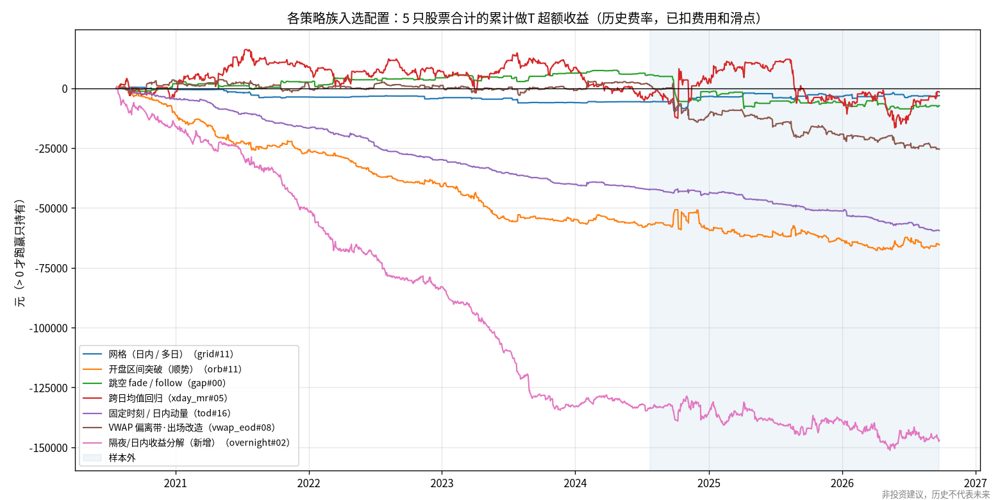
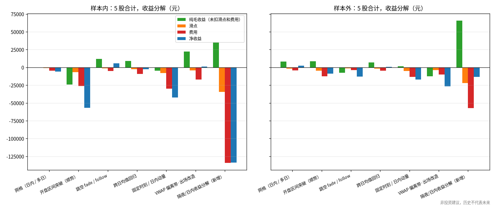
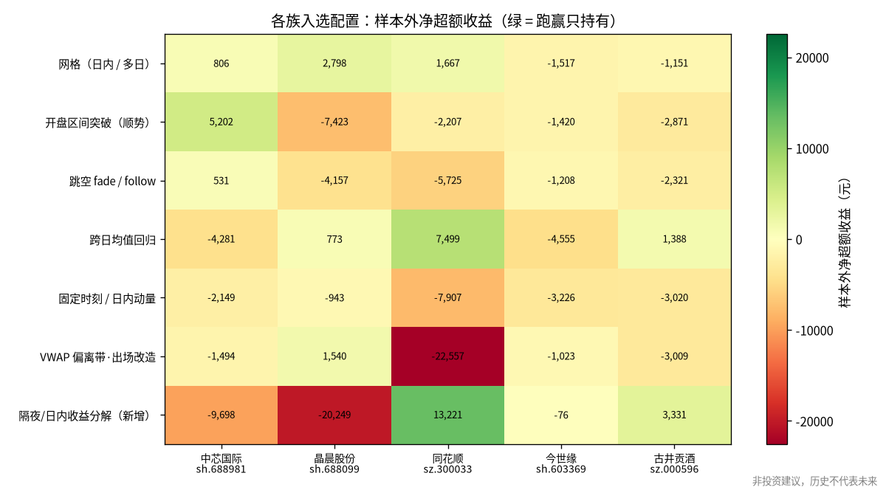
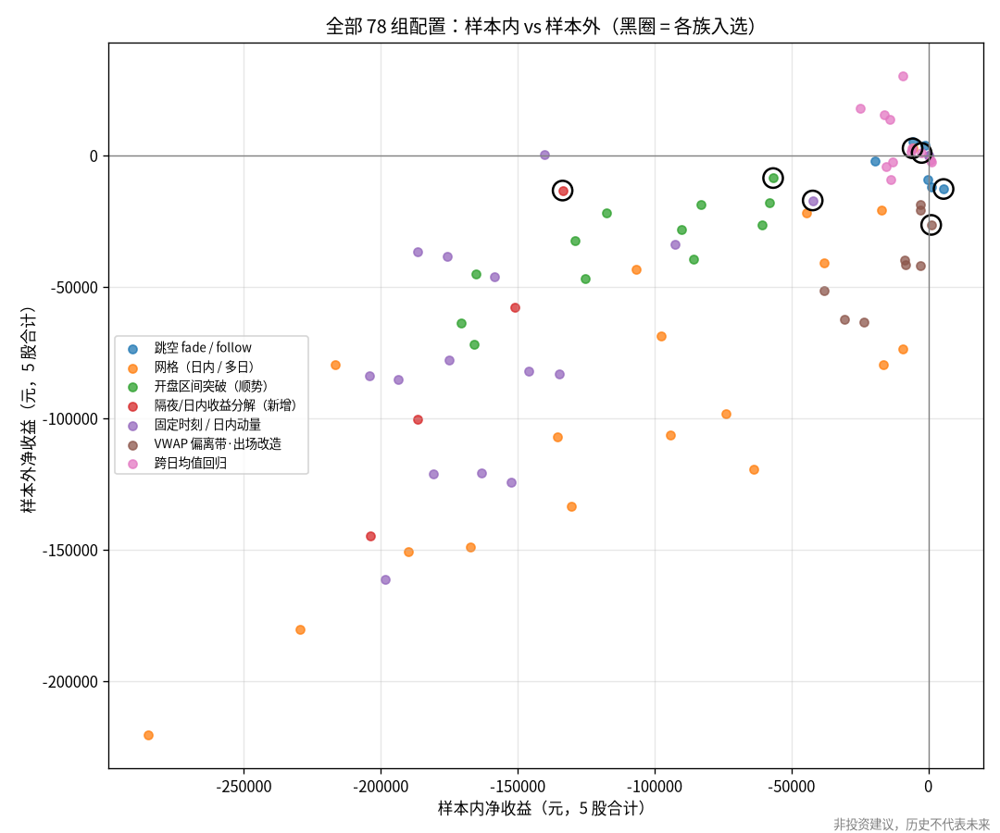

# 做T 策略族普查 · 第二期

> **非投资建议，历史不代表未来。** 本报告只基于历史数据回测，不构成任何买卖建议，不承诺收益。
> 仓库不含任何个人持仓或账户信息，各股票的底仓规模只是示例（按市值折算，见第一期 §6）。

## 0. 结论

**7 个策略族、78 组参数、5 只股票：没有任何一个族在扣费后表现出稳健的超额收益。** 按预注册的三条标准，7 个族全部判为「无效」。

- **78 组配置中，没有一组在样本内和样本外同时为正**（5 股合计口径）。
- 各族的样本内最优配置，其样本内日夏普率在 -0.28 ~ +0.03 之间。缩减夏普率（DSR）在预注册口径下全部为 0.000；
  即使改用更宽松的口径，最高也只有 0.047，远低于 0.95 的门槛。
- 样本外为正的只有网格（+2,603 元）和跨日均值回归（+824 元），但单侧 p 值分别为 0.31 和 0.49，
  离校正后的阈值 0.0071 很远，而且都只在 3/5 只股票上为正。
- 失败原因可以归为三类，详见 §3：
  1. **成本大于信号**：开盘区间突破、固定时刻、隔夜。
  2. **样本内的优势在样本外反转**：跳空反向、VWAP 出场改造。
  3. **优势接近零，噪声远大于信号**：网格、跨日均值回归。
- **唯一值得记住的现象是「14:50 → 次日开盘」的收益偏负**（包含尾盘最后 10 分钟和隔夜）：14:50 卖出、次日开盘买回，纯毛收益在两个时段都为正（每笔 +4bp / +12.5bp）。
  但它不够覆盖做T 的成本，仅法定印花税就足以让样本内亏损（§4）。
- **建议**：只持有底仓仍然优于本期测试的所有做T 方式。不建议在这 5 只股票上继续用「只看自身价格」的规则做日内或跨日做T（§5）。

### 跨族汇总（各族样本内最优配置，5 股合计，单位元，使用历史费率）

「净收益」是相对只持有底仓的超额收益，**> 0 才跑赢持有**。「毛收益」含滑点、未扣费用。
同期 5 只股票只持有底仓的合计盈亏：样本内 **-12,365**，样本外 **+52,020**。

| 策略族              | 入选配置         |    净收益 内 |   净收益 外 |   毛收益 内 |   毛收益 外 | 闭环 内/外      | 胜率 内/外    | 最大回撤 内/外           | 跑赢持有 内/外   | 判定   |
|:-----------------|:-------------|---------:|--------:|--------:|--------:|:------------|:----------|:-------------------|:-----------|:-----|
| 网格（日内 / 多日）      | grid#11      |   -5,742 |   2,603 |  -1,263 |   6,699 | 178 / 174   | 49% / 57% | -6,518 / -4,199    | 否 / 是      | 无效   |
| 开盘区间突破（顺势）       | orb#11       |  -56,683 |  -8,720 | -30,611 |   3,687 | 956 / 555   | 36% / 42% | -58,946 / -16,969  | 否 / 否      | 无效   |
| 跳空 fade / follow | gap#00       |    5,581 | -12,879 |  10,819 |  -9,049 | 202 / 168   | 58% / 48% | -3,081 / -14,535   | 是 / 否      | 无效   |
| 跨日均值回归           | xday_mr#05   |   -2,435 |     824 |   6,720 |   5,364 | 351 / 210   | 50% / 48% | -21,293 / -28,615  | 否 / 是      | 无效   |
| 固定时刻 / 日内动量      | tod#16       |  -42,225 | -17,245 | -12,363 |  -3,805 | 1064 / 619  | 30% / 38% | -42,742 / -17,508  | 否 / 否      | 无效   |
| VWAP 偏离带·出场改造    | vwap_eod#08  |    1,057 | -26,543 |  18,094 | -16,472 | 647 / 475   | 50% / 48% | -6,564 / -27,476   | 是 / 否      | 无效   |
| 隔夜/日内收益分解（新增）    | overnight#02 | -133,579 | -13,470 |     641 |  43,680 | 4832 / 2611 | 43% / 49% | -135,552 / -22,667 | 否 / 否      | 无效   |

各族入选配置的完整判定（区间、p 值、每笔优势与成本、DSR）：

| 策略族              | 入选配置                                               |   样本内净收益 |   样本外净收益 | 样本外95%区间          |   样本外单侧p | 样本内纯毛收益/毛收益/费用             | 样本外纯毛收益/毛收益/费用             | 闭环 内/外      | 样本外为正股票数   | 每笔纯毛优势/成本(bp) 内   | 每笔纯毛优势/成本(bp) 外   |   样本内日夏普 | DSR(N=78) 预注册口径 / 宽松口径   | 判定   |
|:-----------------|:---------------------------------------------------|---------:|---------:|:------------------|---------:|:---------------------------|:---------------------------|:------------|:-----------|:------------------|:------------------|---------:|:-------------------------|:-----|
| 网格（日内 / 多日）      | grid#11：mode=atr, spacing=8, anchor=vwap           |    -5742 |     2603 | [-7,908, 12,684]  |   0.3098 | -214 / -1,263 / 4,478      | 8,258 / 6,699 / 4,096      | 178 / 174   | 3/5        | -0.8 / 20.2       | 21.9 / 15.0       |   -0.061 | 0.000 / 0.000            | 无效   |
| 开盘区间突破（顺势）       | orb#11：n_or=12, buffer=1.0, sides=zheng            |   -56683 |    -8720 | [-37,236, 21,857] |   0.709  | -24,000 / -30,611 / 26,071 | 8,447 / 3,687 / 12,407     | 956 / 555   | 1/5        | -14.3 / 19.5      | 7.4 / 15.0        |   -0.159 | 0.000 / 0.000            | 无效   |
| 跳空 fade / follow | gap#00：theta=0.5, mode=fade                        |     5581 |   -12879 | [-35,612, 7,633]  |   0.8805 | 12,095 / 10,819 / 5,238    | -7,574 / -9,049 / 3,830    | 202 / 168   | 1/5        | 37.2 / 20.0       | -21.1 / 14.8      |    0.025 | 0.000 / 0.047            | 无效   |
| 跨日均值回归           | xday_mr#05：anchor=ma20, theta=2.0, max_hold_days=5 |    -2435 |      824 | [-53,301, 51,456] |   0.4918 | 9,113 / 6,720 / 9,155      | 7,114 / 5,364 / 4,540      | 351 / 210   | 3/5        | 15.1 / 19.2       | 17.2 / 15.2       |   -0.003 | 0.000 / 0.005            | 无效   |
| 固定时刻 / 日内动量      | tod#16：mode=mom, theta=0.5                         |   -42225 |   -17245 | [-26,851, -8,338] |   1      | -4,557 / -12,363 / 29,862  | 1,387 / -3,805 / 13,440    | 1064 / 619  | 0/5        | -2.3 / 19.1       | 1.1 / 15.1        |   -0.279 | 0.000 / 0.000            | 无效   |
| VWAP 偏离带·出场改造    | vwap_eod#08：k=5.0, s=0.0                           |     1057 |   -26543 | [-54,614, 759]    |   0.9728 | 22,387 / 18,094 / 17,037   | -12,602 / -16,473 / 10,071 | 647 / 475   | 1/5        | 20.5 / 19.5       | -13.8 / 15.3      |    0.004 | 0.000 / 0.010            | 无效   |
| 隔夜/日内收益分解（新增）    | overnight#02：side=short, exit=open                 |  -133579 |   -13470 | [-55,615, 29,463] |   0.7388 | 35,248 / 641 / 134,220     | 65,723 / 43,680 / 57,150   | 4832 / 2611 | 2/5        | 4.0 / 19.2        | 12.5 / 15.1       |   -0.206 | 0.000 / 0.000            | 无效   |





## 1. 研究设置

- 规则、参数网格、选择标准和判定标准都在运行**之前**提交（commit `42c7b3f`）：
  [`preregistration.md`](preregistration.md) 和 [`configs/survey_grid.yaml`](../../configs/survey_grid.yaml)。
  引擎和策略代码在运行前单独提交（commit `118ac22`）。
- 与第一期相同的 5 只股票、样本切分、成交与滑点假设、历史真实费率、T+1 / 涨跌停 / 申报数量规则。
- 新增的引擎能力（均有单元测试）：
  - 多日持有：`max_hold_days` 为 N 时，偏离底仓后的第 N 个交易日 14:50 强制回到底仓。
  - 开盘前指令：以第一根 K 线开盘价成交。
  - 一笔成交越过底仓时，把闭环拆成两段记账。
  - 每个时段开始前重置策略状态。
- **选择**：每个族只选一组参数，所有股票共用，标准是 5 股合计的样本内净收益最高（且合计闭环数 ≥ 100）。样本外只评估一次。
- **判定「稳健有效」须同时满足**：
  1. 5 股合计样本外净收益 > 0，且单侧自助法 p < 0.05/7（按族数做 Bonferroni 校正）；
  2. 样本外至少 4/5 只股票为正；
  3. 样本内 DSR ≥ 0.95，试验次数 N = 78。

### 与预注册的偏离（如实说明）

1. **配置数**：预注册文档把网格族写成 24 组、总计 84 组，这是计数错误。YAML 网格实际为 6+6+3+3 = 18 组，总计 78 组。
   **网格本身没有任何改动**，DSR 按实际的 N = 78 计算。
2. **毛收益的口径**：运行中发现，按闭环价差计算的毛收益，对跨除权除息日的持仓会把除权造成的价格下跌当成收益。
   例如同花顺 2026-04-10 有大比例送转，隔夜做空因此被虚增约 9,200 元。
   因此把毛收益统一改为「逐日盯市净收益 + 费用」，纯毛收益 = 毛收益 + 滑点，并补充了单元测试。
   **净收益、选择和判定一直使用逐日盯市口径，不受影响**。
3. **新增一个宽松 DSR 口径**作为敏感性分析（试验间夏普方差取纯噪声水平 1/T，而不是 78 组配置的实际方差）。
   这是因为费用拖累使很多配置大幅为负，拉大了实际方差，预注册口径因此偏严。判定仍按预注册口径，两种口径的结论相同。
4. §4 的成本敏感性是事后探索，不参与判定。
5. **固定时刻族里「13:00 开仓」的 2 组配置在数据上无法触发**：5 分钟 K 线里没有在 13:00 结束的 K 线，午间收盘后第一根下午 K 线在 13:05 结束。
   所以这 2 组的交易次数为 0，因闭环数不足不参与选择。事后按 13:05 补跑作为参考（不参与选择）：
   倒T 样本内 -156,359 元、样本外 -17,638 元；正T 样本内 -181,960 元、样本外 -145,299 元（5 股合计）。即使纳入网格也不会入选，结论不变。

## 2. 跨族对比（逐股票与合计）

各族样本内最优配置，单位元。「内/外」分别表示样本内和样本外。

| 策略族              | 股票             | 净收益 内/外            | 毛收益 内/外          | 闭环 内/外      | 胜率 内/外    | 最大回撤 内/外           | 只持有 内/外          | 跑赢持有 内/外   |
|:-----------------|:---------------|:-------------------|:-----------------|:------------|:----------|:-------------------|:-----------------|:-----------|
| 网格（日内 / 多日）      | 中芯国际 sh.688981 | -2,963 / 806       | -1,922 / 1,558   | 50 / 35     | 30% / 60% | -3,068 / -1,377    | -12,116 / 28,280 | 否 / 是      |
| 网格（日内 / 多日）      | 晶晨股份 sh.688099 | -456 / 2,798       | 288 / 3,319      | 22 / 21     | 59% / 71% | -1,666 / -491      | 4,687 / 14,320   | 否 / 是      |
| 网格（日内 / 多日）      | 同花顺 sz.300033  | -2,034 / 1,667     | -492 / 3,369     | 72 / 57     | 54% / 58% | -2,195 / -2,680    | -9,618 / 40,590  | 否 / 是      |
| 网格（日内 / 多日）      | 今世缘 sh.603369  | -228 / -1,517      | 336 / -984       | 18 / 28     | 50% / 50% | -750 / -1,925      | 3,624 / -13,784  | 否 / 否      |
| 网格（日内 / 多日）      | 古井贡酒 sz.000596 | -60 / -1,151       | 527 / -563       | 16 / 33     | 69% / 52% | -1,073 / -1,539    | 1,058 / -17,386  | 否 / 否      |
| 网格（日内 / 多日）      | 5股合计           | -5,742 / 2,603     | -1,263 / 6,699   | 178 / 174   | 49% / 57% | -6,518 / -4,199    | -12,365 / 52,020 | 否 / 是      |
| 开盘区间突破（顺势）       | 中芯国际 sh.688981 | -6,437 / 5,202     | -2,370 / 7,974   | 209 / 127   | 35% / 46% | -7,089 / -5,768    | -12,116 / 28,280 | 否 / 是      |
| 开盘区间突破（顺势）       | 晶晨股份 sh.688099 | -14,332 / -7,423   | -8,437 / -4,475  | 174 / 123   | 40% / 46% | -16,986 / -11,114  | 4,687 / 14,320   | 否 / 否      |
| 开盘区间突破（顺势）       | 同花顺 sz.300033  | -9,684 / -2,207    | -4,751 / 1,108   | 226 / 114   | 33% / 37% | -12,277 / -8,496   | -9,618 / 40,590  | 否 / 否      |
| 开盘区间突破（顺势）       | 今世缘 sh.603369  | -14,884 / -1,420   | -9,680 / 148     | 171 / 87    | 37% / 44% | -17,010 / -1,830   | 3,624 / -13,784  | 否 / 否      |
| 开盘区间突破（顺势）       | 古井贡酒 sz.000596 | -11,344 / -2,871   | -5,373 / -1,068  | 176 / 104   | 35% / 37% | -12,677 / -4,191   | 1,058 / -17,386  | 否 / 否      |
| 开盘区间突破（顺势）       | 5股合计           | -56,683 / -8,720   | -30,611 / 3,687  | 956 / 555   | 36% / 42% | -58,946 / -16,969  | -12,365 / 52,020 | 否 / 否      |
| 跳空 fade / follow | 中芯国际 sh.688981 | 1,449 / 531        | 2,612 / 1,672    | 58 / 51     | 66% / 51% | -771 / -3,568      | -12,116 / 28,280 | 是 / 是      |
| 跳空 fade / follow | 晶晨股份 sh.688099 | 4,764 / -4,157     | 6,018 / -3,291   | 35 / 36     | 69% / 42% | -3,128 / -5,524    | 4,687 / 14,320   | 是 / 否      |
| 跳空 fade / follow | 同花顺 sz.300033  | -4,070 / -5,725    | -2,886 / -4,756  | 56 / 33     | 48% / 52% | -4,087 / -8,604    | -9,618 / 40,590  | 否 / 否      |
| 跳空 fade / follow | 今世缘 sh.603369  | 828 / -1,208       | 1,832 / -668     | 34 / 30     | 56% / 47% | -1,353 / -2,142    | 3,624 / -13,784  | 是 / 否      |
| 跳空 fade / follow | 古井贡酒 sz.000596 | 2,611 / -2,321     | 3,243 / -2,006   | 19 / 18     | 53% / 50% | -870 / -4,056      | 1,058 / -17,386  | 是 / 否      |
| 跳空 fade / follow | 5股合计           | 5,581 / -12,879    | 10,819 / -9,049  | 202 / 168   | 58% / 48% | -3,081 / -14,535   | -12,365 / 52,020 | 是 / 否      |
| 跨日均值回归           | 中芯国际 sh.688981 | -604 / -4,281      | 830 / -3,398     | 74 / 40     | 57% / 48% | -3,936 / -16,513   | -12,116 / 28,280 | 否 / 否      |
| 跨日均值回归           | 晶晨股份 sh.688099 | 7,544 / 773        | 9,413 / 1,712    | 61 / 39     | 52% / 54% | -7,313 / -10,193   | 4,687 / 14,320   | 是 / 是      |
| 跨日均值回归           | 同花顺 sz.300033  | -1,655 / 7,499     | 97 / 8,524       | 81 / 36     | 53% / 56% | -16,735 / -10,536  | -9,618 / 40,590  | 否 / 是      |
| 跨日均值回归           | 今世缘 sh.603369  | -1,635 / -4,555    | 316 / -3,740     | 69 / 45     | 45% / 42% | -12,581 / -7,751   | 3,624 / -13,784  | 否 / 否      |
| 跨日均值回归           | 古井贡酒 sz.000596 | -6,085 / 1,388     | -3,936 / 2,266   | 66 / 50     | 41% / 44% | -9,246 / -7,511    | 1,058 / -17,386  | 否 / 是      |
| 跨日均值回归           | 5股合计           | -2,435 / 824       | 6,720 / 5,364    | 351 / 210   | 50% / 48% | -21,293 / -28,615  | -12,365 / 52,020 | 否 / 是      |
| 固定时刻 / 日内动量      | 中芯国际 sh.688981 | -2,799 / -2,149    | 856 / 474        | 188 / 117   | 26% / 40% | -2,945 / -2,495    | -12,116 / 28,280 | 否 / 否      |
| 固定时刻 / 日内动量      | 晶晨股份 sh.688099 | -10,663 / -943     | -2,947 / 1,509   | 221 / 100   | 33% / 54% | -10,975 / -2,342   | 4,687 / 14,320   | 否 / 否      |
| 固定时刻 / 日内动量      | 同花顺 sz.300033  | -6,151 / -7,907    | -1,959 / -4,536  | 196 / 121   | 30% / 40% | -6,431 / -8,138    | -9,618 / 40,590  | 否 / 否      |
| 固定时刻 / 日内动量      | 今世缘 sh.603369  | -10,703 / -3,226   | -3,800 / -680    | 236 / 141   | 31% / 29% | -10,792 / -3,440   | 3,624 / -13,784  | 否 / 否      |
| 固定时刻 / 日内动量      | 古井贡酒 sz.000596 | -11,910 / -3,020   | -4,513 / -572    | 223 / 140   | 31% / 31% | -12,111 / -3,603   | 1,058 / -17,386  | 否 / 否      |
| 固定时刻 / 日内动量      | 5股合计           | -42,225 / -17,245  | -12,363 / -3,805 | 1064 / 619  | 30% / 38% | -42,742 / -17,508  | -12,365 / 52,020 | 否 / 否      |
| VWAP 偏离带·出场改造    | 中芯国际 sh.688981 | -2,805 / -1,494    | 294 / 616        | 160 / 100   | 47% / 53% | -3,965 / -4,851    | -12,116 / 28,280 | 否 / 否      |
| VWAP 偏离带·出场改造    | 晶晨股份 sh.688099 | 314 / 1,540        | 3,350 / 3,172    | 92 / 68     | 46% / 46% | -6,736 / -2,301    | 4,687 / 14,320   | 是 / 是      |
| VWAP 偏离带·出场改造    | 同花顺 sz.300033  | -3,976 / -22,557   | -280 / -19,936   | 171 / 96    | 48% / 38% | -4,626 / -25,287   | -9,618 / 40,590  | 否 / 否      |
| VWAP 偏离带·出场改造    | 今世缘 sh.603369  | 3,555 / -1,023     | 7,028 / 740      | 115 / 99    | 56% / 52% | -2,015 / -3,227    | 3,624 / -13,784  | 是 / 否      |
| VWAP 偏离带·出场改造    | 古井贡酒 sz.000596 | 3,970 / -3,009     | 7,702 / -1,065   | 109 / 112   | 57% / 51% | -2,472 / -4,968    | 1,058 / -17,386  | 是 / 否      |
| VWAP 偏离带·出场改造    | 5股合计           | 1,057 / -26,543    | 18,094 / -16,473 | 647 / 475   | 50% / 48% | -6,564 / -27,476   | -12,365 / 52,020 | 是 / 否      |
| 隔夜/日内收益分解（新增）    | 中芯国际 sh.688981 | -18,226 / -9,698   | 650 / 1,642      | 970 / 519   | 38% / 46% | -18,855 / -11,924  | -12,116 / 28,280 | 否 / 否      |
| 隔夜/日内收益分解（新增）    | 晶晨股份 sh.688099 | -60,572 / -20,249  | -27,007 / -7,701 | 970 / 526   | 41% / 44% | -61,109 / -20,751  | 4,687 / 14,320   | 否 / 否      |
| 隔夜/日内收益分解（新增）    | 同花顺 sz.300033  | -19,340 / 13,221   | 1,464 / 27,931   | 969 / 523   | 44% / 54% | -19,678 / -3,904   | -9,618 / 40,590  | 否 / 是      |
| 隔夜/日内收益分解（新增）    | 今世缘 sh.603369  | -15,226 / -76      | 13,324 / 9,356   | 965 / 523   | 45% / 50% | -17,961 / -3,800   | 3,624 / -13,784  | 否 / 否      |
| 隔夜/日内收益分解（新增）    | 古井贡酒 sz.000596 | -20,215 / 3,331    | 12,210 / 12,452  | 958 / 520   | 44% / 53% | -22,928 / -2,764   | 1,058 / -17,386  | 否 / 是      |
| 隔夜/日内收益分解（新增）    | 5股合计           | -133,579 / -13,470 | 641 / 43,680     | 4832 / 2611 | 43% / 49% | -135,552 / -22,667 | -12,365 / 52,020 | 否 / 否      |



**参数稳健性**：各族所有参数组合在两个时段的表现如下。「事后最好」只作展示，不参与选择。

| 策略族              |   组数 |   样本内为正的组数 |   样本外为正的组数 |   两段都为正的组数 | 事后样本外最好（仅展示）                       | 入选配置样本外排名   |
|:-----------------|-----:|-----------:|-----------:|-----------:|:-----------------------------------|:------------|
| 跳空 fade / follow |    6 |          2 |          2 |          0 | gap#03 5,019（样本内 -5,639）           | 6/6         |
| 网格（日内 / 多日）      |   18 |          0 |          1 |          0 | grid#11 2,603（样本内 -5,742）          | 1/18        |
| 开盘区间突破（顺势）       |   12 |          0 |          0 |          0 | orb#11 -8,720（样本内 -56,683）         | 1/12        |
| 隔夜/日内收益分解（新增）    |    4 |          0 |          0 |          0 | overnight#02 -13,470（样本内 -133,579） | 1/4         |
| 固定时刻 / 日内动量      |   17 |          0 |          1 |          0 | tod#06 385（样本内 -140,222）           | 4/17        |
| VWAP 偏离带·出场改造    |    9 |          1 |          0 |          0 | vwap_eod#07 -18,738（样本内 -2,737）    | 3/9         |
| 跨日均值回归           |   12 |          2 |          7 |          0 | xday_mr#02 30,310（样本内 -9,482）      | 7/12        |



## 3. 逐族结论：为什么失败

| 策略族 | 结论 | 主要原因 |
|---|---|---|
| 网格（日内 / 多日） | 无效 | 18 组中样本内**全部亏损**；入选的是最宽的间距（8×ATR5、锚定 VWAP），本质上是「很少交易」（4 年、5 只股票合计只有 178 个闭环）。样本外 +2,603 元不显著。窄间距配置换手很高，最差的一组样本内亏损超过 28 万元。多日网格在单边行情里会被迫在最差位置时间止损 |
| 开盘区间突破（顺势） | 无效 | 12 组在两个时段**全部亏损**。样本内纯毛收益为负（每笔 -14bp），也就是顺着开盘区间突破的方向交易，在这些股票上并没有动量优势；样本外纯毛收益转正（+7bp），但仍低于 15bp 的成本 |
| 跳空 fade / follow | 无效 | 反向做跳空在样本内有明显优势（每笔 +37bp，净收益 +5,581 元），样本外反转为 -21bp（-12,879 元），在 4/5 只股票上亏损。6 组里没有一组两段都为正，是典型的样本内偶然 |
| 跨日均值回归 | 无效 | 每笔纯毛优势（样本内 15bp / 样本外 17bp）与成本（19bp / 15bp）大致相当。持有多日带来很大的方向性风险：样本外合计的 95% 区间为 [-53,301, +51,456]，信号完全淹没在噪声里。7/12 组样本外为正，但样本内为正的组样本外反而不好（0 组两段都为正） |
| 固定时刻 / 日内动量 | 无效 | 12 个可以触发的固定时刻规则每天都交易，费用巨大，样本内全部亏损 13 万 ~ 20 万元（13:00 的 2 组无法触发，见 §1 偏离说明第 5 条）。「首半小时 → 尾盘半小时」日内动量的纯毛优势约 0（-2bp / +1bp），在这些股票上看不到文献中的日内动量效应 |
| VWAP 偏离带·出场改造 | 无效 | 第一期 §8 的建议：持有到尾盘、不设紧止损。样本内纯毛优势 20.5bp 略高于成本（净收益 +1,057 元），样本外反转为 -13.8bp（-26,543 元）。第一期事件研究里「样本外回归效应明显减弱」的担心得到了证实 |
| 隔夜/日内收益分解（新增） | 无效 | 见 §4。存在真实但很小的隔夜负收益，在两个时段都存在，但每天一次往返的成本远大于它 |

## 4. 费用拖累与成本敏感性（事后探索，不参与判定）

各族入选配置在更低成本下的 5 股合计净超额收益，单位元。
B = 佣金 0.01% 且无最低 5 元；C = B 再加零滑点，是理论上限，印花税等法定费用无法避免。

| 策略族              | 入选配置         |   A 当前口径 样本内 |   A 当前口径 样本外 |   B 低佣金无最低 样本内 |   B 低佣金无最低 样本外 |   C 低佣金+零滑点 样本内 |   C 低佣金+零滑点 样本外 |
|:-----------------|:-------------|-------------:|-------------:|---------------:|---------------:|----------------:|----------------:|
| 网格（日内 / 多日）      | grid#11      |        -5742 |         2603 |          -4380 |           3986 |           -3331 |            5544 |
| 开盘区间突破（顺势）       | orb#11       |       -56683 |        -8720 |         -49620 |          -4576 |          -43012 |             184 |
| 跳空 fade / follow | gap#00       |         5581 |       -12879 |           7096 |         -11630 |            8372 |          -10155 |
| 跨日均值回归           | xday_mr#05   |        -2435 |          824 |            132 |           2383 |            2505 |            4039 |
| 固定时刻 / 日内动量      | tod#16       |       -42225 |       -17245 |         -34434 |         -12673 |          -26632 |           -7482 |
| VWAP 偏离带·出场改造    | vwap_eod#08  |         1057 |       -26543 |           5739 |         -23041 |           10054 |          -19172 |
| 隔夜/日内收益分解（新增）    | overnight#02 |      -133579 |       -13470 |         -97949 |           5807 |          -63357 |           27845 |

- **即使在理论上限场景 C 下，也没有一个族在两个时段都有像样的正收益**。
  - 跨日均值回归在 B、C 下两段都小幅为正（C：+2,505 / +4,039 元），但它的样本外区间宽达 ±5 万元，统计上毫无意义。
  - 网格在 C 下样本内仍为负。
- **隔夜**：做空隔夜（14:50 卖出底仓、次日开盘买回）的纯毛收益在两个时段都为正（样本内 +35,248 元，每笔 4bp；样本外 +65,723 元，每笔 12.5bp）。
  这与「A 股隔夜收益偏低」的现象方向一致。注意这里测的是 14:50 到次日开盘，不是严格的收盘到开盘。但在场景 C 下样本内仍亏损 63,357 元，仅印花税（卖出 0.05%，2023-08 以前为 0.1%）就超过了这部分优势。
  **做T 无法利用它**。它唯一的实际意义是：如果本来就要卖出（例如调仓），在尾盘卖通常比次日开盘卖略好。这不需要额外交易，也不产生额外成本，但仍需单独验证。

## 5. 多重比较、局限与下一步

**多重比较**：本期共做了 7 个族 × 78 组参数 × 5 只股票 × 2 个时段的回测。按以下几个层次控制：
- 每个族只选一组、所有股票共用的参数（按样本内合计）；
- 样本外只检验 7 个入选配置，并做 Bonferroni 校正；
- 样本内用 DSR 扣除「从 78 次试验里挑最好」的选择偏差；
- 同时要求跨股票一致。
即便不做任何校正，也没有一个族通过：样本外为正的两个族，未校正的 p 值也只有 0.31 和 0.49。

**局限**：
- 5 只股票、样本外约 2 年，统计功效有限。「无效」的准确含义是「没有证据表明有效」，不是「证明无效」。
- 5 分钟 K 线看不到 K 线内部路径；封板判断只看整根 K 线；假设现金充足。
- 同花顺 2026-04-10 大比例送转之后，引擎仍按原底仓股数计算，底仓对应的市值口径略有变化。这只影响最后约 5 个月。

**下一步建议**（按优先级）：
1. **停止在这 5 只股票上搜索「只看自身价格」的做T 规则**。两期合计已经测试了 VWAP 族的 18 个网格格子、36 个过滤器，加上本期 78 组配置，
   没有稳健结果。继续搜索只会增加过拟合。
2. **如果继续研究，换信息源而不是换规则**：接入指数和板块的分钟数据（baostock 不提供，需要新的 `DataSource`），检验大盘/板块状态、
   个股相对强弱这类外生信息，能否改善某个族的样本外表现。仍然要先预注册。
3. **把隔夜效应当作执行层面的优化，而不是做T 策略**：对本来就要发生的买卖，检验「尾盘卖、开盘买」相对于随机时点的执行改善。
   这不增加换手，也就不增加成本。

## 6. 复现与文件

```bash
pip install -r requirements.txt && pip install -e . && pytest
python scripts/survey.py          # 约 30 秒（4 核）→ reports/survey/
python scripts/survey_costs.py    # 成本敏感性（事后探索）
```

| 路径 | 内容 |
|---|---|
| `reports/survey/preregistration.md`、`configs/survey_grid.yaml` | 预注册（先于运行提交） |
| `reports/survey/tables.md` | 全部表格（自动生成） |
| `reports/survey/winners.json` | 各族入选配置、区间、p 值、DSR、判定 |
| `reports/survey/cross_family.csv`、`cross_family_wide.md` | 跨族对比（逐股票与合计） |
| `reports/survey/pooled_configs.csv`、`all_configs.csv` | 全部配置：5 股合计 / 逐股票逐时段 |
| `reports/survey/cost_sensitivity.md` | 成本敏感性（事后探索） |
| `reports/survey/*.png` | 图表：累计收益、收益分解、样本外热力图、全部配置样本内 vs 样本外 |
| `src/tlab/strategies/families.py` | 7 个策略族的实现 |

**再次声明：非投资建议，历史不代表未来。**
